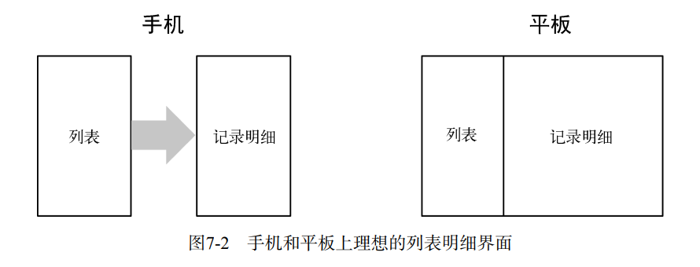
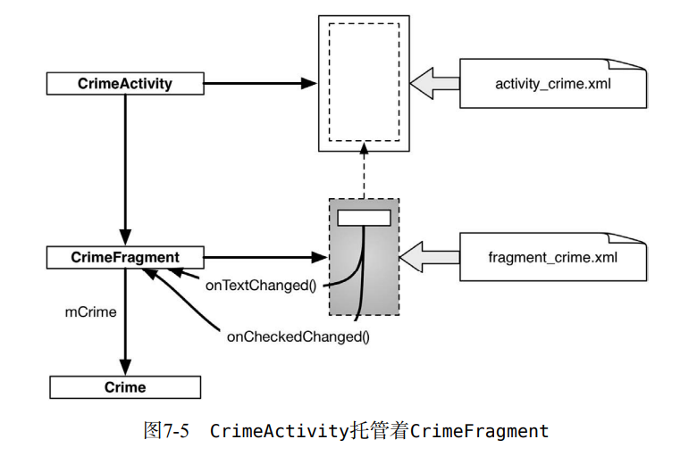

> 《Android Studio编程权威指南》 chapter7

# 关于fragment

## 什么是fragment
fragment是一种控制器对象，activity可委派它执行任务。这些任务通常就是管理用户界面。受管的用户界面可以是一整屏或是整屏的一部分。

## 为何采用fragment
- 采用fragment而不是activity来管理应用UI，可一套代码适配手机和平板端
- 绕开Android系统activity使用规则的限制。
- fragment用来封装关键组件以方便复用



使用UI fragment将应用的UI分解成构件块，可构建定制界面，如分页界面、动画侧边栏。

## fragment使用
activity视图能预留位置供fragment视图插入。activity在其视图层级里提供一处位置，用来放置fragment视图，fragment本身没有在屏幕上显示视图的能力。因此，只有将它的视图放置在activity的视图层级结构中，fragment视图才能显示在屏幕上。



### 引入fragment
fragment来自于AppCompat库
```
// app/build.gradle

apply plugin: 'com.android.application'
android {
 ...
}
dependencies {
 compile fileTree(dir: 'libs', include: ['*.jar'])
 ...
 compile 'com.android.support:appcompat-v7:25.0.1'  //使用最新版本
 ...
}

// .java
import android.support.v4.app.Fragment;
```

为托管UI fragment，activity必须：
- 在其布局中为fragment的视图安排位置；
- 管理fragment实例的生命周期。

fragment生命周期与activity生命周期的一个关键区别就在于，fragment的生命周期方法由托
管activity而不是操作系统调用。操作系统不关心activity用来管理视图的fragment。fragment的使
用是activity内部的事情。

activity托管UI fragment有如下两种方式：
- 在activity布局中添加fragment；
- *在activity代码中添加fragment。*

```
<FrameLayout
    xmlns:android="http://schemas.android.com/apk/res/android"
    android:id="@+id/fragment_container"
    android:layout_width="match_parent"
    android:layout_height="match_parent"/>
```

创建UI fragment的步骤与创建activity的步骤相同：
- 定义用户界面布局文件；
- 创建fragment类并设置其视图为定义的布局；
- 编写代码以实例化组件。

