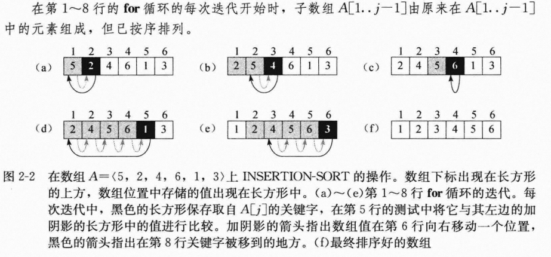
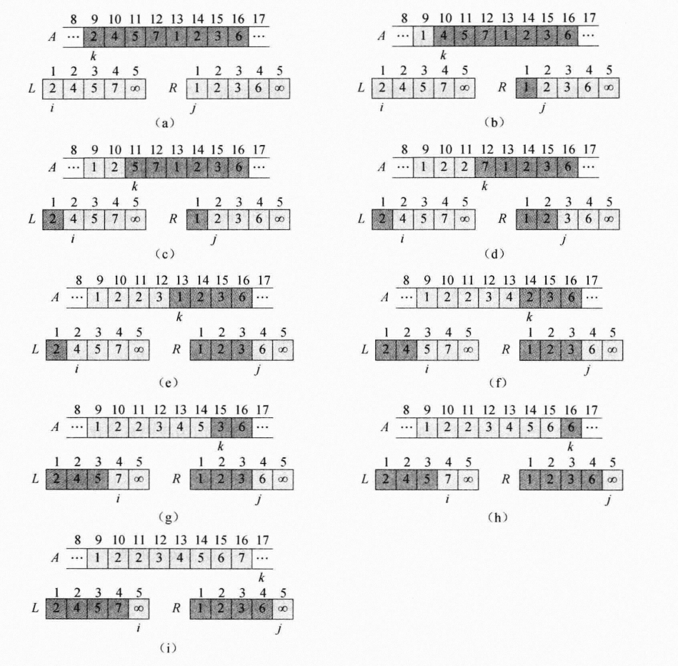
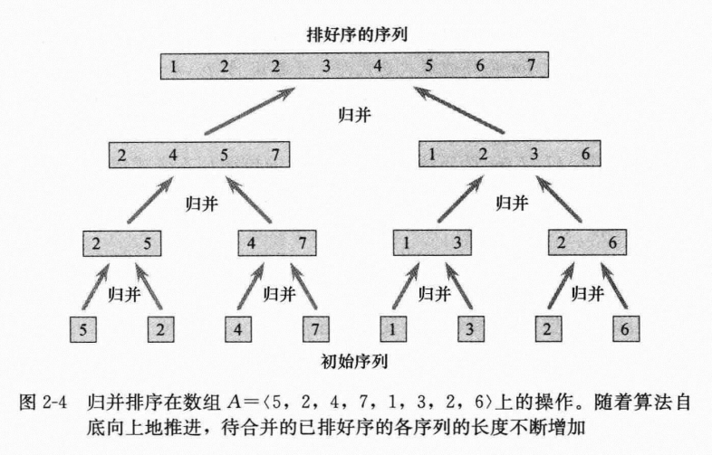

> 算法导论(原书第三版)

# 第一章 算法在计算中的作用 略

---

# 第二章 算法基础

## 2.1 插入排序

输入：n个数的一个序列
输出：输入序列的从小到大排列

```
INSERTION_SORT(A)
for j=2 to A.length
    key = A[j]
    //Insert A[j] into the sorted sequence A[1..j - 1].
    i = j - 1

    while i > 0 and A[i] > key
        A[i + 1] = A[i]
        i = i - 1
    A[i + 1] = key
```



**循环不等式**
- 初始化：循环的第一次迭代之前，它为真
- 保持：如果循环的某次迭代之前它为真，那么下次迭代之前它仍为真
- 终止：在循环终止时，不变式为我们提供一个有用的性质，该性质有助于证明算法是正确的

## 2.2 分析算法

输入规模、运行时间、最坏情况与平均情况分析、增长量级

## 2.3 设计算法

**分冶法**：将原问题分解为几个规模较小但类似于原问题的子问题，递归求解这些子问题，再合并这些子问题的解来建立原问题的解。

```
/* A是一个数组，p、q、r是数组下标，满足p<=q<r。假设子数组A[p..q]和A[q+1..r]都已排好序。合并这两个子数组代替当前子数组A[p..r] */
/* ∞作为哨兵值，避免检查是否有堆为空 */

MERGE(A, p, q, r)
    n1 = q - p + 1
    n2 = r - q
    let L[1..n1 + 1] and R[1..n2 + 1] be new arrays

    for i = 1 to n1
        L[i] = A[p + i - 1]
    for j = 1 to n2
        R[j] = A[q + j]

    L[n1 + 1] = ∞
    R[n2 + 1] = ∞
    i = 1
    j = 1

    for k = p to r
        if L[i] <= R[j]
            A[k] = L[i]
            i = i + 1
        else A[k] = R[j]
            j = j + 1
```



```
MERGE_SORT(A, p, r)
if p < r
    q = ⌊(p + r)/2⌋
    MERGE_SORT(A, p, q)
    MERGE_SORT(A, q+1, r)
    MERGE(A, p, q, r)
```



---

# 第三章 函数的增长

## 3.1 渐进记号