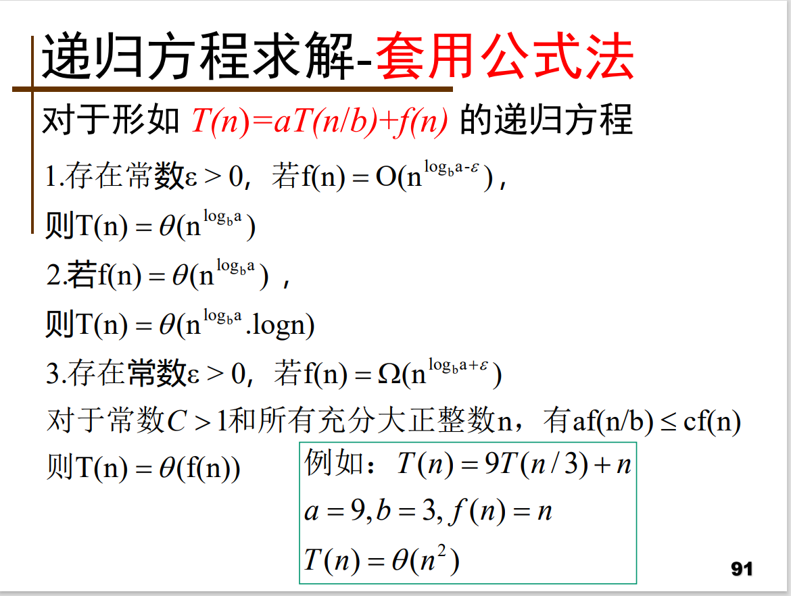

算法是对计算机上执行的**计算过程的具体描述**
性质
- **输入**：有零个或多个外部量作为算法的输入
- **输出**：算法产生至少一个量作为输出
- **确定性**：组成算法的每条指令清晰、无歧义
- **有限性**：算法中每条指令的执行次数有限，执行每条指令的时间也有限（**程序可以不满足有限性**）
- **能行性**

算法与数据结构的关系
- 算法是数据结构的**灵魂**
- 数据结构则是算法的**基础**
**算法＋数据结构＝程序**

正确性
- 定义：在给定**有效**输入后，算法经过**有限**时间的计算并产生**正确**的答案，就称算法是正确的

工作量——时间复杂性分析
- 计量工作量的标准: 对于给定问题，该算法所执行的**基本运算的次数**
- 基本运算的选择：根据问题选择适当的基本运算

占用空间——空间复杂性分析
- 两种占用
    - **存储程序和输入数据**的空间
    - 存储**中间结果或操作单元**所占用空间——额外空间
- 空间复杂性考虑的是**额外空间**的大小
- 如果额外空间相对于输入规模是常数，称为**原地工作的算法**

简单性
- 含义：算法简单，程序结构简单
- **简单的算法效率不一定高**
保证一定**效率**的前提下力求得到简单的算法

最优性
- 含义：指求解某类问题中**效率最高的算法**
- 两种最优性
    - 最坏情况：**最坏情况下的最优算法**
    - 平均情况：**平均情况下的最优算法**

解同一个问题，*算法不同，则计算的工作量也不同*，所需的计算时间随之不同，即复杂性不同

最优性：寻找最优算法的途径 (以**最坏情况下的最优性**
为例)
- 设计算法A，求W(n)。对问题给出**最坏情况下的一
个上界**。
- 寻找函数F(n)，使得对任何算法都存在一个规模为
n的输入并且该算法在这个输入下**至少要做F(n)次
基本运算**。
- 如果W(n)=F(n)，则A是最优的。
- 如果W(n)>F(n)，A不是最优的或者F(n)的下界过低。
    - 改进A或设计新算法A’使得W’(n)<W(n)。
    - 重新证明新下界F’(n)使得F’(n)>F(n)。
    - 重复以上两步，最终得到W’(n) = F’(n)为止

复杂性的计量
- **算法复杂性**是算法运行所需要的计算机资源的
量，需要时间资源的量称为**时间复杂性**，需要的空间资源的量称为**空间复杂性**
- 算法复杂性应该只依赖于算法要解的**问题的规模、算法的输入和算法本身的函数**

若出现**递归调用**，则上述由里向外逐层剥的分析**行不通：递归方程**，用**求递归方程解的渐进阶**的方法确定最坏情况下的复杂性的渐进阶

定理：
如果算法的执行时间不随着问题规模n的增加而增长，即使算法中有上千条语句，其执行时间也不过是一个较大的常数。此类算法的时间复杂度是O(1)
规模较小的问题,决定算法工作效率的可能是算法的简单性而不是算法执行的时间

递归的优势是表示某些定义非常自然，容易理解，但是会使*算法的时间复杂度大大提升，耗费更多的资源*
**边界条件**与**递归方程**是递归函数的两个要素

Hanoi塔问题
设 a,b,c 是 3 个塔座。开始时，在塔座 a 上有一叠共 n 个圆盘，这些圆盘自下而上，由大到
小地叠在一起。各圆盘从小到大编号为 1,2,…,n,现要求将塔座 a 上的这一叠圆盘移到塔座 c 上，并仍按同样顺序叠置。
在移动圆盘时应遵守以下移动规则：
（1）每次只能移动 1 个圆盘；
（2）任何时刻都不允许将较大的圆盘压在较小的圆盘之上；
（3）在满足移动规则 1 和 2 的前提下，可将圆盘移至 a,b,c 中任一塔座上。
``` java
public static void hanoi(int n,int a,int b,int c){
    if(n==1){
        move(a,c);
    }else if(n>1){
        hanoi(n-1,a,c,b);   //将n-1个盘子由a经过c移动到b
        move(a,c);  //执行最大盘子n移动
        hanoi(n-1,b,a,c);   //剩下的n-1个盘子由b经过a移动到c
    }
}
```

- 优点：结构清晰，可读性强，而且容易用数学归纳法来证明算法的正确性，因此它为设计算法、调试程序带来很大方便
- 缺点：递归算法的运行效率较低，无论是耗费的计算时间还是占用的存储空间都比非递归算法要多
- 解决方法：在递归算法中**消除递归**调用，使其转化为非递归算法
    - 采用一个**用户定义的栈**来模拟系统的递归调用工作栈。该方法**通用性强**，但本质上还是递归，只不过人工做了本来由编译器做的事情，**优化效果不明显**
    - 用**递推**来实现递归函数

递推
- 递推算法是一种用**若干步可重复**的简单运算（规律）来描述复杂问题的方法
- 递推算法以初始{起点}值为基础，用相同的运算规律，逐次**重复运算**，直至运算结束
- 这种从“起点”重复相同的方法直至到达一定“边界”，犹如**单向运动**，用循环可以实现。递推的本质是按规律逐次推出（计算）下一步的结果

- **分治法的基本思想**
    1. 大问题分解为子问题，这些子问题互相独立且与原问题相同
    2. 分别**求解子问题**。如果子问题的规模仍然不够小，则再划分为k个子问题，如此递归的进行下去，直到问题规模足够小，很容易求出其解为止
    3. **合并**解，**自底向上**逐步求出原来问题的解
- 分治法的**设计思想**
    - 将一个难以直接解决的大问题，分割成一些**规模较小的相同**问题，以便各个击破，分而治之
- **分治法的适用条件**
    - 问题的**规模缩小**到一定的程度就可以容易地解决
    - 问题具有最优子结构性质（当问题的最优解包含了其子问题的最优解时，称该问题具有最优子结构性质）
    - 分解出的子问题的解可以**合并**为该问题的解
    - 问题所分解出的各个子问题是**相互独立**的，即子问题之间不包含公共的子问题
如果各子问题是不独立的，则分治法要做许多不必要的工作，重复地解公共的子问题，此时虽然也可用分治法，但一般用**动态规划**较好

**分治法的基本步骤**
``` c
devide-and-conquer(P){
    if(|P|<=n0) adhoc(P);   //解决小规模的问题
    devide P into smaller sub_instances P1,P2...;
    for(int i=1;i<=k;i++)
        yi=devide-and-conquer(Pi);  //递归求解子问题

    return merge(y1,y2...); //合并
}
```

*在用分治法设计算法时，最好使子问题的规模大致相同*



归并排序（见md）：**T(n)=O(nlogn) 渐进意义下的最优算法**
- 归并排序占用**附加存储**较多，需要另外一个与原待排序记录数组同样大小的辅助数组。这是这个算法的**缺点**
- 与快速排序和堆排序相比，归并排序的最大特点是，它是一种**稳定**的排序方法

冒泡排序：**平均情况**时间复杂度为O(n2)

快速排序
基本思想：通过**一趟排序**将要排序的数据**分割成独立的两部分**，其中一部分的所有数据都比另外一部分的所有数据都要**小**，然后再按此方法对这两部分数据分别进行快速排序，整个排序过程可以**递归**进行，以此达到整个数据变成有序序列

快速排序算法**最坏情况**下的时间复杂度为**O(n2)**，而**平均**时间复杂度为**O(n*logn)**

[循环赛日程表](https://blog.csdn.net/weixin_44469806/article/details/108936037)

堆heap：
特殊的**二叉树**，是一个从上到下有**大小关系**的二叉树。父节点值大于或等于其孩子节点值的，叫“最大堆（maximum heap)”;父节点值小于或
等于孩子节点值的，叫“最小（minimum heap)”
[堆排序算法](https://blog.csdn.net/u010452388/article/details/81283998)

计数排序：
集合A有n个元素，每一个元素的值是*介于0到k之间的整数*。计数排序的基本思想是对每一个输入元素x，确定出小于x的元素个数。有了这一信息，就可以把x直接放到它在最终输出数组 的位置上。例如：若有5个元素小于x，则x就属于第6个输出位置

基数排序：

-[x] 2.7 线性时间排序

# 第三章 贪心算法
> 单源最短路径 最小生成树

- 总是做出**在当前看来最好的选择**
- 并不从整体最优考虑
- **局部最优选择**

*贪心法的基本思路：*从问题的某一个初始解出发逐步逼近给定的目标，以**尽可能快的**地求得更好的解。当达到某算法中的某一步不能再继续前进时，算法停止

*贪心法存在的问题*
- 不能保证求得的最后解是最佳的
- 不能用来求**最大或最小解问题**
- 只能求**满足某些约束条件的可行解**的范围
在一些情况下，即使贪心算法不能得到整体最优解，其最终结果却是**最优解的很好近似**

**贪心算法求解的问题性质**
- **贪心选择性质**
    - 所谓贪心选择性质是指所求问题的*整体最优解可以通过一系列局部最优的选择*，即贪心选择来达到
    - 贪心算法则通常以**自顶向下**的方式进行，*每作一次贪心选择就将所求问题简化为规模更小的子问题*
- **最优子结构性质**
    - 当一个问题的**最优解包含其子问题的最优解**时，称此问题具有最优子结构性质。问题的最优子结构性质是该问题可用动态规划算法或贪心算法求解的关键特征

活动安排问题
``` java
public static int greedySelector(int []s,int []f,boolean a[]){
    int n=l.length-1;
    a[1]=true;  //选择最早结束活动
    int j=1;    //j表示已安排活动编号
    int count=1;    //已安排活动数
    for(int i=2;i<=n;i++){  //i表示待安排活动
        if(s[i]>=f[j]){
            a[i]=true;
            j=i;
            count++;
        }else{
            a[i]=false;
        }
    }
    return count;
}
```
如果所给出的活动未按结束时间升序排列，可以用**O(nlogn)**的时间重排

*背包问题（可以选择物品i的一部分）可以用贪心算法求解，而0-1背包问题却不能用贪心算法求解*
- 0-1背包问题贪心选择之所以不能得到最优解：因为无法保证最终能将背包装满，部分闲置的背包空间使总价值降低了
用贪心策略求解背包问题时，首先要选出**最优的度量标准**（价值、重量、单位价值）

背包问题
``` c
void Knapsack(int n,float C,float v[],float w[],float x[]){
    Sort(n,v,w);    //按物品单位价值vi/wi从大到小排序
    int i;
    for(i=1;i>=n;i++)
        x[i]=0; //x[i]装入与否

    float c=C;  //C为背包体积
    for(i=1;i<=n;i++){
        if(w[i]>c) break;
        x[i]=1;
        c-=w[i];
    }

    if(i<=n) x[i]=c/w[i];   //有剩余则填满背包
}
```

0-1背包问题
``` c
void 0-1-Knapsack(int n,float C,float v[],float w[],float x[]){ //不一定最优解
    Sort(n,v,w);
    int i;
    for(i=1;i<=n;i++)   x[i]=0;
    float c=C;
    for(i=1;i<=n;i++){
        if(w[i]>c) break;
        x[i]=1;
        c-=w[i];
    }
}
```

哈夫曼编码：用于数据文件压缩。给出现频率高的字符较短的编码，出现频率较低的字符以较长的编码，可以大大缩短总码长

前缀码：对每一个字符规定一个0,1串作为其代码，并要求任一字符的代码都不是其它字符代码的前缀。表示最优前缀码的二叉树总是一棵**完全二叉树**，即树中任一结点都有2个儿子结点
哈夫曼算法以**自底向上的方式构造**表示最优前缀码的二叉树T

## 单源最短路径(Single-Source Shortest-Paths Problem)
给定**带权有向图G** =(V,E)，其中每条边的权是**非负实数**。另外，还给定V中的一个顶点，称为源

单源最短路径问题：已知图G＝（V，E），找出从某给定的源结点s∈V到V中的每个结点的最短路径

**Dijkstra算法**是解单源最短路径问题的**贪心算法**
- 基本思想：设置顶点集合S并不断地作贪心选择来扩充这个集合。一个*顶点属于集合S当且仅当从源到该顶点的最短路径长度已知*。
- 特殊路径：设u是G的某一个顶点，把从源到u且中间只经过S中顶点的路称为从源到u的**特殊路径**，用数组D[i]记录顶点i当前所对应的**最短特殊路径长度**

Dijkstra算法的基本思想：
1. 设S为最短距离已**确定**的顶点集（**红点集**），V-S是最短距离**尚未确定**的顶点集（**蓝点集**）
2. **初始化**:最初只有源点s的最短距离是已知的(D(s)=0)，故红点集S={s}
3. 重复以下工作，按**路径长度递增**次序产生各顶点最短路径:在当前蓝点集中选择一个D[i]最小的蓝点扩充到红点集，更新其余蓝点集D[i]值。
4. 当蓝点集中仅剩下最短距离为∞的蓝点，或者所有蓝点已扩充到红点集时，s到所有顶点的最短路径就求出来了

Dijkstra算法Relax描述
d[u]:s到u的距离 p[u]:记录前一节点 Relax松弛算法
Init-single-source(G,s) //初始化。G为点集，s为源点
for each v∈V(G)
do{
    d[v]=∞
    p[v]=NULL
}
d[s]=0,p[s]=NULL

Relax(u,v,w)
if d[v]>d[u]+w(u,v)
then {
    d[v]=d[u]+w[u,v]    //取最短距离
    p[v]=u
}

dijkstra(G,w,s)
1. Init-single-source(G,s)  //O(v)
2. S=s //初始红点集
3. Q=V[G]-S //初始蓝点集
4. while Q<> 非空
    do u=min(Q) //用数组O(v)
        S=S=u   //u进入红点集除去蓝点集
        Q=V[G]-S
        for each v∈adj[u] && v∈Q    //O(E)
            do Relax(u,v,w)

## 最小生成树

设G =(V,E)是**无向连通**带权图，即一个网络。E中每条边(v,w)的权为c[v][w]。如果G的**子图G’是一棵包含G的所有顶点的树**，则称G’为G的生成树。
- 生成树上各边权的总和称为该**生成树的耗费**
- 在G的所有生成树中，耗费最小的生成树称为G的最小生成树

**最小生成树性质**：设G=(V，E)是一个**连通网络**，U是*顶点集V的一个真子集*。若(u，v)是G中所有的一个端点在U(u∈U)里、另一个端点不在U(即v∈V-U)里的边中，具有最小权值的一条边，则一定存在G的一棵最小生成树包括此边(u，v)。这个性质称为MST（Minimum Spanning Tree ）性质
- 集合U中的顶点——红色顶点
- V-U中的顶点——蓝色顶点
- 连接红点和蓝点的边——紫色边
- 权最小的紫边称为轻边(即权重最“轻”的边)

### Prim（普里姆）算法

设G=(V,E)是连通带权图，V={1,2,…,n}
Prim算法构造G的最小生成树基本思想
1. 初始U={1}
2. 只要U是V的真子集，就作如下的贪心选择：选取满足条件*i∈U，j∈V-U，且c[i][j]最小的边*，将*顶点j*添加到U中
3. 这个过程一直进行到U=V时为止
在这个过程中选取到的所有边恰好构成G的一棵最小生成树。（按**逐个将顶点连通**的方式来构造最小生成树的。）

PrimMST(G,T,r)  //求图G以r为根的MST，结果放在T中
{
    T=φ;U={1};
    while(U!=V) //O(V
    {
        (i,j)=i∈U，j∈V-U，且c[i][j]最小的边 //O(V)
        T=T∪ (i，j) //轻边 (i，j) 加入T
        U=U ∪ {j};  // 节点j 加入U，变为红点
    }
}

- 若候选轻边集中的**轻边不止一条**，可**任选**其中的一条扩充到T中
- 若一个蓝点与多个红点有边相接，选权最小的边做紫边
- 连通网的**最小生成树不一定是惟一的，但它们的权相等**
- 用这个办法实现的Prim算法所需的计算时间为O(V2)，与图中边数无关，该算法适合于**稠密图**

### Kruskal（克鲁斯卡尔）算法

构造最小生成树的基本思想
1. 新建图G，G中**拥有原图中相同的节点，但没有边**
2. 将原图中所有的**边按权值从小到大**排序
3. 从**权值最小**的边开始，如果这条边连接的两个节点于图G中不在同一个连通分量中，则添加这条边到图G中
4. 重复(3)，直至图G中所有的节点都在同一个连通分量中

算法思想
1. T的初始状态:只有n个顶点而无边的森林T=(V，￠ )
2. ②按边长递增的顺序选择E中的n-1安全边(u，v)并加入T，生成MST

- **安全边**指两个端点分别是森林T里两棵树中的顶点的边。加入安全边，可将森林中的两棵树连接成一棵更大的树
- 因为每一次添加到T中的边均是当前权值最小的安全边，MST性质也能保证最终的T是一棵最小生成树

MST-Kruskal (G) //求连通网G的一棵MST
{
    T=(V，￠)； //初始化，T是只含n个顶点不包含边的森林
    sort the edges of E by non-decreasing weight w  //依权值递增序对E(G)中的边排序，并设结果在E[0..e-1]中 **O(Elog(E)**
    for(i=0;i<E;i++) //E为图中边总数，**O(E)**
    {
        取第i条边（u,v）
        if u和v分别属于T中两棵不同的
        T=T∪{(u，v)}；//(u，v)是安全边，将其加入T中
    }

    return T
}

克鲁斯卡尔算法的时间复杂度为**O(ElogE)**
Kruskal算法的时间主要取决于边数。它较适合于**稀疏图**

NP完全问题(Non-deterministic Polynomial Complete Problem) ，也即是多项式复杂程度的非确定性问题 ，到目前为止还没有有效的解.对于这一类问题,用贪心选择策略有时可以设计出**较好的近似算法**。

# 第四章 动态规划DP

多阶段决策问题->单阶段问题

最优化原理
假设为了解决某一优化问题，需要依次作出n个决策D1，D2，…，Dn，如若这个决策序列是最优的，对于任何一个整数k，1 < k < n，不论前面k个决策是怎样的，以后的最优决策只**取决于**由前面决策所确定的**当前状态**，即以后的决策Dk+1，Dk+2，…，Dn也是最优的。（最优子结构性质）

动态规划求解条件
- 问题中的状态必须满足**最优化原理**
- 问题中的状态必须满足**无后效性**
所谓的无后效性是指：“*下一时刻的状态只与当前状态有关*，而和当前状态之前的状态无关，*当前的状态是对以往决策的总结*”

动态规划法的定义：在求解问题中，对于*每一步决策，列出各种可能的局部解*，再依据某种判定条件，*舍弃*那些肯定不能得到最优解的局部解，在每一步都经过筛选，以*每一步都是最优解来保证全局是最优解*
动态规划通常应用于*最优化问题*，即做出一组选择以达到一个最优解。关键是*存储子问题的每一个解*，以备它重复出现
*动规经分解得到的子问题往往不是互相独立的*。

数字三角形问题
声明部分；
输入a数组,M行N列；//下标从1开始
for (j = 1; j <= N; j++) //O(N)
    D[M][j]=a[M][j];
for (i = M-1; i >=1; i--) //自底向上DP
    for (j =M-i+1,n=1; n<=2*i; j++,n++)
        D[i][j]=min(D[i+1][j],D[i+1,j-1])+a[i][j];
cout<<min(D[1]); //输出第一行最小值

动态规划设计步骤
1. 划分**阶段**：按照问题的时间或空间特征，把问题
分为若干个阶段
2. 确定**状态**：将问题发展到各个阶段时所处的各种
客观情况用不同的状态表示出来
3. 确定决策并写出**状态转移方程**：状态转移就是根据上一阶段的状态和决策来导出本阶段的状态，所以如果确定了决策，状态转移方程也就可以写出
4. 寻找**边界条件**：状态转移方程是一个递推式，需要一个**递推的终止条件或边界条件**
5. 程序设计实现

**动态规划与一般搜索技术最大不同的地方就是记录了已求解过的问题的结果**

动态规划基本步骤
1. 找出最优解的性质，并刻划其结构特征
2. **递归地定义最优值**
3. 以**自底向上**的方式计算出最优值
4. 根据计算最优值时得到的信息，构造最优解

在**贪婪算法**中，每采用一次贪婪准则便做出一个**不可撤回**的决策，而在动态规划中，还要考察每个最优决策序列中是否包含一个最优子序列

动态规划算法的基本要素
- **最优子结构性质:某个问题的最优解包含着其子问题的最优解**
    - 最优子结构是问题**能用**动态规划算法求解的前提
- **重叠子问题**性质:递归算法求解问题时，每次产生的子问题并不总是新问题，有些子问题被反复计算多次
    - 动态规划算法对**每一个子问题只解一次**，而后将其解**保存**在一个表格中
- 备忘录方法:为每个解过的子问题建立了备忘录

LIS问题(Longest Increasing Subsequence)
**b[i]=max{b[j] (1<=j<i) | a[i]> a[j] } + 1**
其中b[i]代表以a[i]结尾的LIS的长度

0-1背包问题-改变m(i,j)含义
m(i，j)是背包容量为j，可选择物品为1,2,3...i时0-1背包问题的最优值
···
m(1，j)是背包容量为j，可选择物品为1时0-1背包问题的最优值。**规模最小**

第i件
- 不放，背包当前产生价值仍为m(i+1，j)
- 放入，调整背包容量j-wi，背包当前产生价值为 m(i+1, j-wi) + vi

m(i,j)递推式
- 0<=j<wi   m(i+1，j)
- j>=wi max{m(i+1，j),m(i+1, j-wi) + vi}

# 第五章 回溯法

要找到一组解，或找到一个满足某些限制的最优解

算法思想:
通过对问题的分析，找出一个解决问题的线索，然后沿着这个**线索**往前**试探**，若试探成功，就得到解，若试探失败，就**逐步往回退**，换别的路线再往前试探。
若在**深度搜索**过程中碰到**条件不满足**，则退回上一层，在**每一层上也进行全面的搜**

**回溯法**是**带优化的穷举法**
回溯法的基本思想：在一棵**含有问题全部可能解**的**状态空间树**上进行**深度优先**搜索，*解为叶子结点*
在回溯法中，并不是先构造出整棵状态空间树，再进行搜索，而是在搜索过程中逐步构造出状态空间树，即**边搜索，边构造**

回溯法**在包含问题的所有解的解空间树中**，按照**深度优先**的策略，从根结点出发搜索解空间树。
算法搜索至解空间树的任一结点时，总是先判断该结点**是否肯定不包含问题的解**。
1. **不包含**，则跳过对以该结点为根的子树的系统搜索，**逐层**向其祖先结点**回溯**
2. 否则，进入该子树，继续按深度优先的策略进行搜索

- 回溯法在用来求问题的**所有解**时，要回溯到**根**，且**根结点的所有子树**都已被搜索遍才结束
- 回溯法在用来求问题的任一解时，只要搜索到问题的**一个解**就可以结束

- **扩展结点**：一个**正在产生儿子**的结点称为扩展结点
- **活结点**：一个自身已生成但其**儿子还没有全部生成**的节点称做活结点
- **死结点**：一个**所有儿子已经产生**的结点称做死结点

1. 从开始结点（根结点）出发，以深度优先的方式搜索整个解空间。开始结点->活结点，同时也成为当前的扩展结点。
2. 在当前的扩展结点处，搜索向纵深方向移至一个新结点。这个新结点就成为一个新的活结点，并成为当前扩展结点
3. 如果在当前的扩展结点处不能再向纵深方向移动，则当前扩展结点就成为死结点。此时，应往回移动（回溯）至最近的一个活结点处，并使这个活结点成为当前的扩展结点。
回溯法即以这种工作方式递归地在解空间中搜索，*直至找到所要求的解或解空间中已没有活结点时为止*

回溯法为了避免生成那些**不可能产生最佳解**的
问题状态，要不断地利用**限界函数**(bounding
function)；
目的->处死那些实际上不可能产生所需解的活结点，以**减少问题的计算量**
*具有限界函数的深度优先搜索算法称为回溯法*

回溯法的**应用步骤**
1. 针对所给问题，定义问题的**解空间**
2. 确定易于搜索的**解空间结构**
3. 以**深度优先**的方式搜索解空间，并且在搜索过程中用**剪枝函数**避免无效搜索
    - 用**约束函数**在扩展结点处剪去**不满足约束**的子树
    - 用**限界函数**剪去**得不到最优解**的子树

回溯法的一个显著特征是在搜索过程中**动态产生问题的解空间**。
在任何时刻，算法只保存*从根结点到当前扩展结点*的路径。

``` C
void backtrack (int t) //
{
    if (t>n) output(x); //当搜索到叶结点，输出可行解
    else {
        for (int i=f(n,t);i<=g(n,t);i++) { //从下界 to 上界
    `       x[t]=h(i);
            if (Constraint(t) && Bound(t)) //满足约束条件和限界函数
                backtrack(t+1);
        }
    }
}
```

## n皇后问题

任意两个皇后都不能处于同一行、同一列或同一斜线上

1. 从空棋盘起，逐行放置棋子。
2. 每在一个布局中放下一个棋子，即推演到一个新的布局
3. 如果当前行上没有可合法放置棋子的位置，则回溯到上一行，重新布放上一行的棋子

二维数组A[N][N]存储皇后位置
一维数组M[k]、L[k]、R[k]分别表示竖列、左斜线、右斜线是否放有棋子,有则值为1,否则值为0

for(某一行的每个位置) {
    if (安全) {
        放皇后;
        if (已到最后一行) { 输出; }
        else 试探下一行;
        去皇后;
    }
}

安全算法：!M[j]&&!R[i-j+N]&&!L[i+j];
放皇后：A[i][j]=M[j]=R[i-j+N]=L[i+j]=1;
去皇后：A[i][j]=M[j]=R[i-j+N]=L[i+j]=0;

实际搜索解空间树策略:
约束函数：左子结点是一个可行结点，搜索其左树。
限界函数：右子树有可能包含最优解时才进入右子树搜索，否则将右子树剪去

- 递归是一种算法结构，直接或间接地调用自己。
- 回溯是一种算法思想，可以用递归实现

# 第六章 分支限界法

- 求解目标
    - 回溯法:找出解空间树中满足约束条件的**所有解**
    - 分支限界法:找出满足约束条件的**一个解**，或是在满足约束条件的解中找出在某种意义下的最优解
- 搜索方式
    - 回溯法:深度优先
    - 分支限界法:**广度优先**或以最小耗费优先

分支限界法基本思想
- 在分支限界法中，*每一个活结点只有一次机会成为扩展结点。活结点一旦成为扩展结点，就一次性产生其所有儿子结点*
- 在这些儿子结点中，导致不可行解或导致非最优解的儿子结点被舍弃，其余儿子结点被加入**活结点表**中
- 此后，从活结点表中取下一结点成为当前扩展结点，并重复上述结点扩展过程。这个过程一直持*续到找到所需的解或活结点表为空时为止*

常见的两种分支限界法
- 队列式(FIFO)分支限界法
    - 按照队列先进先出（FIFO）原则选取下一个节点为扩展节点
    - 数据结构：**队列**
- 优先队列式分支限界法
    - 按照优先队列中规定的优先级选取优先级最高的节点成为当前扩展节点
    - 数据结构：**堆**

# 第九章 NP完全性理论

问题的**计算复杂性**可以通过解决问题所需**计算量**的多少来度量
易：可在**多项式时间**(O(nk))内解决的问题
难：需要**指数函数**(O(kn))时间解决的问题

在进行问题的计算复杂性分析之前，首先必须建立求解问题所用的**计算模型**，包括定义该计算模型中所用的基本运算
建立计算模型的目的是为了使问题的计算复杂性分析有一个**共同的客观尺度**

3个基本计算模型
- 随机存取机RAM
- 随机存取**存储程序**机RASP
- **图灵机**(Turing Machine)

根据**有限**状态控制器的当前状态及每个读写头读到的带符号，图灵机的一个计算步可实现下面**3个**操作之一或全部
- **改变**有限状态控制器中的状态
- **清除**当前读写头下的方格中原有带符号并**写上新**的带符号
- 独立地将任何一个或所有读写头，向左**移动**一个方格(L)或向右移动一个方格(R)或停在当前单元不动(S)

k带图灵机可形式化地描述为一个7元组(Q，T，I，δ，b，q0，qf)
- Q是**有限个状态**的集合
- T是**有限个带符号**的集合

非确定性图灵机计算模型简记为
NDTM(Nondeterministic Turing Machine)