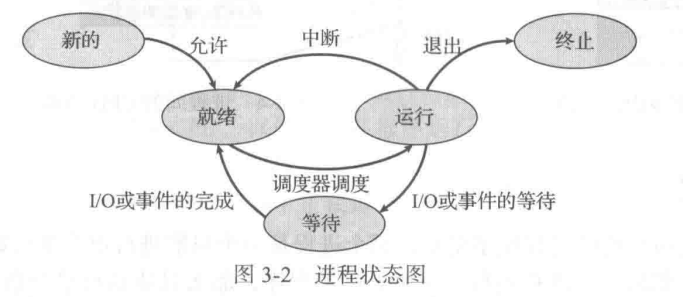
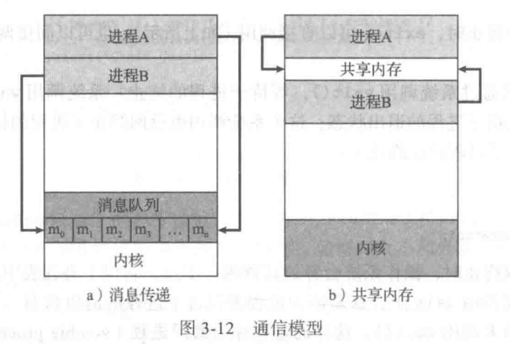

> 操作系统概念（原书第九版）

---

# 第一章 导论

## 1.1 操作系统的功能

- 计算机组件
    - 硬件hardware：为系统提供基本的计算资源
        - 中央处理单元CPU、内存memory、输入/输出设备I/O device
    - 应用程序application program：规定了用户为解决计算问题而使用这些资源的方式
    - 操作系统：控制硬件，并协调各个用户应用程序的硬件使用
    - 用户

- 操作系统设计目的
    - 单个用户：使用方便>性能>资源利用
    - 多个用户：优化资源使用率，确保所有的CPU时间、内存和I/O都能得到有效使用，并且确保没有用户使用超过限额以外的资源

从计算机的角度来看，操作系统是与硬件紧密相连的**程序**，**资源分配器**，**控制程序**（特别注重I/O设备的运行和控制）

*操作系统定义：*
操作系统是一直运行在计算机上的程序（**内核kernel**）（程序分为内核、系统程序system program和应用程序）

## 1.2 计算机系统的组成

现代通用计算机系统包括若干CPU、设备控制器，通过公用总线相连而成，总线提供了共享内存访问。

*计算机系统运行：*
**引导程序**bootstrap program通常很简单，位于计算机的**固件**firmware，如只读内存ROM。定位操作系统内核并且加载到内存。
系统程序在启动时加到内存成为**系统进程**system process或**系统后台程序**system daemon，其生命周期和内核一样。
事件发生通过**中断**interrupt来通知。硬件通过系统总线发送信号到CPU，软件执行**系统调用**system call（也称监督程序调用monitor call）。
CPU被中断后执行中断服务程序，后重新执行被中断的运算。

中断程序的指针表通常位于低地址内存（数组/**中断向量**interrupt vector）。中断体系结构也应保存中断指令的地址。

CPU只能从内存中加载指令，因此执行程序必须位于内存。内存通常为**动态随机访问内存**Dynamic Random Access Memory。

冯·诺依曼体系结构典型指令执行周期：
从内存中获取指令并存到指令寄存器-指令被解码，可能从内存中获取操作数据并存到内部寄存器-执行指令，结果可存到内存

## 1.3 计算机系统的体系结构

- 单处理器系统
- 多处理器系统（并行系统/多核系统）
    - 优点：增加吞吐量、规模经济、增加可靠性
    - 类型：非对称处理（主从关系）、**对称多处理**SMP

根据剩余有效硬件的级别按比例继续提供服务的能力称为**适度退化**graceful degradation。超过适度退化称为**容错**fault tolerant。

## 1.4 操作系统的结构

**多道程序设计**multiprogramming通过安排作业（编码与数据）使得CPU总有一个执行作业，从而提高CPU利用率。

## 1.5 操作系统的执行

现代操作系统是**中断驱动**interrupt driven的。事件总是由中断或**陷阱**trap（或**异常**exception）引起的。

为了确保操作系统的正确运行，必须区分操作系统代码和用户代码的执行。至少需要**用户模式**user mode和**内核模式**kernel mode（监视模式/系统模式/特权模式），计算机可通过一个**模式位**mode bit表示。
当系统引导时，硬件从内核模式开始，然后在用户模式下执行用户程序，一旦有陷阱或中断，硬件从用户模式切换到内核模式。
双重模式执行将可能引起损害的机器指令作为**特权指令**，只有在内核模式下允许执行。若用户模式试图执行则指令非法，并以陷阱形式通知操作系统。

**定时器**timer可防止用户程序陷入死循环，在指定周期后中断计算机。

## 1.6 进程管理

- 操作系统负责进程管理的以下活动
    - 在CPU上调度进程和线程
    - 创建和删除用户进程和系统进程
    - 挂起和重启进程
    - 提供进程同步机制
    - 提供线程通信机制

## 1.7 内存管理

- 操作系统负责内存管理的以下活动
    - 记录内存的哪部分在被使用以及被谁使用
    - 决定哪些进程会被调入或调出内存
    - 根据需要分配和释放内存空间

## 1.8 存储管理

文件时创建者定义的相关信息组合。通常文件内容为程序和数据。文件可以没有格式。

- 操作系统负责文件管理的以下活动
    - 创建和删除文件
    - 创建和删除目录，以便组织文件
    - 提供文件和目录的操作原语
    - 映射文件到外存
    - 备份文件到稳定的存储介质

- 操作系统负责硬盘管理的以下活动
    - 空闲空间管理
    - 存储空间分配
    - 硬盘调度

## 1.9 保护与安全

**保护**protection是一种机制，用于控制进程或用户访问计算机的资源。必须提供手段以便指定控制和实施控制。

## 1.10 内核数据结构

列表、堆栈、队列、树、哈希表、位图

## 1.11 计算环境

传统计算、移动计算、分布计算、客户机-服务器计算、对等计算、虚拟化、云计算、实时嵌入式系统

## 1.12 开源操作系统

---

# 第二章 操作系统结构

## 2.1 操作系统的服务

用户界面User Interface、命令行界面Command-Line Interface、批处理界面batch interface、图形用户界面Graphical User Interface

## 2.2 用户与操作系统的界面

基本方案：命令行界面/命令解释程序command interpreter、图形用户界面GUI

解释程序称为**外壳**shell
命令解释程序的主要功能：获取并执行用户指定的下一条命令；实现方法：命令解释程序本身包含代码以执行这些命令/通过系统程序实现大多数的命令

## 2.3 系统调用

系统调用system call提供操作系统服务接口
每一个操作都需要一个系统调用

应用编程接口Application Programming Interface API
增强程序的可移植性
运行时支持系统提供了系统调用接口system-call interface

## 2.4 系统调用的类型

- 进程控制 process control
- 文件管理 file manipulation
- 设备管理 device manipulation
- 信息维护 information maintenance
- 通信 communication
- 保护 protection

## 2.5 系统程序

- 系统程序system program也称为系统工具system utility
    - 文件管理
    - 状态信息
    - 文件修改
    - 程序语言支持
    - 程序加载与执行
    - 通信
    - 后台服务
        - 一直运行的系统进程称为服务service或子系统subsystem

## 2.6 操作系统的设计与实现

系统设计的首要问题是定义目标和规范
- 用户目标：优良性能
- 系统目标：易于设计、实现和维护，灵活可靠正确高效

重要原则：策略police和机制mechanism分离（做什么、如何做）

## 2.7操作系统的结构

常用设计：将系统分成子系统或模块，而不只是单片系统monolithic system

系统的模块化：分层法layered approach
最低层为硬件，最高层为用户接口。每层只能调用更低层
优点：简化了构造和调试，难点：如何合理定义各层，缺点：效率稍差
设计采用功能更多而数量更少的分层，避免各层定义与交互问题

微内核microkernel技术对内核进行模块化
- 主要功能：为客户端和运行在用户空间中的各种服务提供通信
- 优点：
    - 便于拓展操作系统。所有新服务可在用户空间内增加，不需要修改内核
    - 更好的安全性和可靠性。大多数服务作为用户进程而不是内核进程运行
- 缺点：增加系统功能开销微内核性能受损

操作系统设计最佳方法：**可加载的内核模块**loadable kernel module
- 内核有一组核心组件，无论在启动或运行时，内核都可通过模块链入额外服务
- 设计思想：内核提供核心服务，其他服务可在内核运行时动态实现
- 相较于
    - 分层系统：每个内核部分都有已定义的、受保护的接口。但更灵活，任何模块都可以调用任何模块
    - 微内核：主模块只有核心功能，并知道如何加载模块及让模块进行通信。但更有效，模块无需调用消息传递进行通信

混合系统

## 2.8 操作系统的调试

调试debugging事查找和更正系统（硬件软件）错误。包括性能优化performance turning，即解决处理瓶颈bottleneck改善性能

内核故障称为崩溃crush，内存状态保存到崩溃转储crash dump

## 2.9 操作系统的生成

对于特定计算机场所配置和生成操作系统：
系统生成 SYStemGENeration SYSGEN

## 2.10 系统引导

系统**引导**booting：加载内核以启动计算机的过程
引导程序bootstrap program/引导加载程序bootstrap loader

整个引导程序在加载后，就可以遍历文件系统以寻找操作系统内核并将其加载到内存中，开始执行。这时才说系统是在运行running。

---

# 第三章 进程

## 3.1 进程概念

程序本身不是进程。进程是执行的程序。程序只是被动passive实体。进程是活动active实体。
进程本身也可作为一个环境，用于执行其他代码。

进程可能处于以下状态
- 新的new：进程正在创建
- 运行running：指令正在执行
- 等待waiting：进程等待发生某个事件
- 就绪ready：进程等待分配处理器
- 终止terminated：进程已经完成执行
*一次只有一个进程可在一个处理器上运行；但是很多进程可处于就绪或等待状态。*



操作系统内的每个进程表示，采用**进程控制块PCB**Process Control Block，其包含许多与某个特定进程相关的信息
- 进程状态process state
- 程序计数器program counter：计数器表示进程将要执行的下个指令的地址
- CPU寄存器CPU register
- CPU调度信息CPU-scheduling information：优先级、调度队列的指针和其他参数
- 内存管理信息memory-management information
- 记账信息accounting information
- I/O状态信息I/O status information
PCB简单地作为这些信息的仓库

现代操作系统支持一次能执行多个**线程**thread

## 3.2 进程调度

多道程序设计目标：无论何时都有进程运行，从而最大化CPU利用率
分时系统目的：在进程之间快速切换CPU，以便用户在程序运行时能与其交互

- 作业队列job queue：包括系统内所有进程
- 就绪队列ready queue：驻留在内存中的、就绪的、等待运行的进程
- 设备队列device queue：等待特定I/O设备的进程。每个设备都有自己的设备队列

长期调度程序控制**多道程序程度**degree of multiprogramming（内存中的进程数量）

- I/O密集型进程I/O-bound process：执行I/O
- CPU密集型进程CPU-bound process：执行计算
长期调度程序应选择合理进程组合

中期调度程序medium-term scheduler核心思想是可将进程从内存或CPU竞争种移除，从而降低多道程序程度。称为交换swap。

中断导致CPU从执行当前任务改变到执行内核程序。发生时系统需要保存当前运行在CPU上的进程的**上下文**。进程上下文用PCB表示。
上下文切换context switch：切换CPU到另一个进程需要保存当前进程状态和恢复另一个进程的状态。上下文切换时间是存粹的开销。

## 3.3 进程运行

识别进程：唯一的**进程标识符pid**process identifier

每个新进程可以再创建其他进程，形成进程树process tree。子进程可以从操作系统处直接获得资源，也可以从父进程获得资源子集。*限制子进程只能使用父进程的资源，可以防止创建过多进程，导致系统超载。*父进程可能向子进程传递初始化数据。

进程创建新进程时执行可能
- 父进程与子进程并发执行
- 父进程等待
新进程的地址空间可能
- 子进程是父进程的复制品（程序与数据和父进程相同）
- 子进程加载另一个新程序

进程终止时可以返回状态值到父进程，进程资源由操作系统释放。被终止进位于进程表中的条目依然存在，称为僵尸进程zombie process。一旦父进程调用wait()则释放，若未调用子进程称为孤儿进程orphan process。

## 3.4 进程间通信

进程独立/协作

进程协作：信息共享、计算加速、模块化、方便
需要**进程间通信IPC** InterProcess Communication机制，允许进程交换数据与信息。基本模型由
- 共享内存shared memory
- 消息传递message passing



*生产者-消费者问题*

```
/* 变量in指向缓冲区下一个空位；变量out指向缓冲区第一个满位 */
/* in == out时缓冲区为空；((in + 1)%BUFFER_SIZE) == out时缓冲区为满 */
/* 允许缓冲区的最大值为BUFFER_SIZE-1*/
/* 未处理生产者和消费者同时访问共享内存的问题 */

/* 生产者进程 */
while (true) {
    /* produce an item in next.produced */

    while (((in + 1)%BUFFER_SIZE) == out)
        ;/* do nothing */

    buffer[in] = next.produced;
    in = (in + 1) % BUFFER_SIZE;
}

/* 消费者进程 */
item next.consumed;

while (true) {
    while (in == out)
        ;/* do nothing */

    next.consumed = buffer[out];
    out = (out + 1) % BUFFER_SIZE;

    /* consume the item in next.consumed */
}
```

若进程P和Q需要通信，之间要有通信链路communication link

- 直接通信：明确指定通信的接收者或发送者
- 间接通信：通过邮箱或端口来发送和接收信息，两个进程只有拥有一个共享邮箱时才能通信
无论通信是直接还是间接的，通信进程交换的信息总是驻留在临时队列中。

## 3.5 IPC系统例子 略
## 3.6 客户机/服务器通信

**套接字**socket为通信的端点。通过网络通信的每队进程需要使用一对套接字，即每个进程各有一个。每个套接字由一个IP地址和一个端口号组成。

低于1024的端口用于实现标准服务。IP地址127.0.0.1为特殊IP地址，称为**回送**loopback。

---

# 第4章 多线程编程

## 4.1 概述