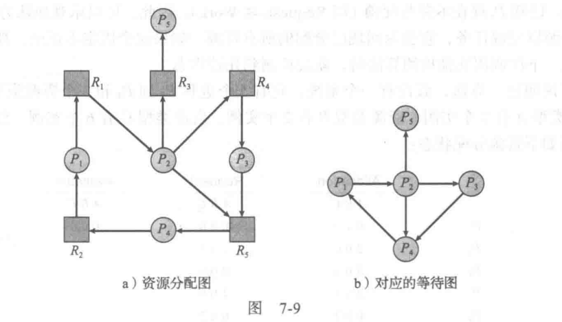

> 操作系统概念（原书第九版）

---

# 第一章 导论

## 1.1 操作系统的功能

- 计算机组件
    - 硬件hardware：为系统提供基本的计算资源
        - 中央处理单元CPU、内存memory、输入/输出设备I/O device
    - 应用程序application program：规定了用户为解决计算问题而使用这些资源的方式
    - 操作系统：控制硬件，并协调各个用户应用程序的硬件使用
    - 用户

- 操作系统设计目的
    - 单个用户：使用方便>性能>资源利用
    - 多个用户：优化资源使用率，确保所有的CPU时间、内存和I/O都能得到有效使用，并且确保没有用户使用超过限额以外的资源

从计算机的角度来看，操作系统是与硬件紧密相连的**程序**，**资源分配器**，**控制程序**（特别注重I/O设备的运行和控制）

*操作系统定义：*
操作系统是一直运行在计算机上的程序（**内核kernel**）（程序分为内核、系统程序system program和应用程序）

## 1.2 计算机系统的组成

现代通用计算机系统包括若干CPU、设备控制器，通过公用总线相连而成，总线提供了共享内存访问。

*计算机系统运行：*
**引导程序**bootstrap program通常很简单，位于计算机的**固件**firmware，如只读内存ROM。定位操作系统内核并且加载到内存。
系统程序在启动时加到内存成为**系统进程**system process或**系统后台程序**system daemon，其生命周期和内核一样。
事件发生通过**中断**interrupt来通知。硬件通过系统总线发送信号到CPU，软件执行**系统调用**system call（也称监督程序调用monitor call）。
CPU被中断后执行中断服务程序，后重新执行被中断的运算。

中断程序的指针表通常位于低地址内存（数组/**中断向量**interrupt vector）。中断体系结构也应保存中断指令的地址。

CPU只能从内存中加载指令，因此执行程序必须位于内存。内存通常为**动态随机访问内存**Dynamic Random Access Memory。

冯·诺依曼体系结构典型指令执行周期：
从内存中获取指令并存到指令寄存器-指令被解码，可能从内存中获取操作数据并存到内部寄存器-执行指令，结果可存到内存

## 1.3 计算机系统的体系结构

- 单处理器系统
- 多处理器系统（并行系统/多核系统）
    - 优点：增加吞吐量、规模经济、增加可靠性
    - 类型：非对称处理（主从关系）、**对称多处理**SMP

根据剩余有效硬件的级别按比例继续提供服务的能力称为**适度退化**graceful degradation。超过适度退化称为**容错**fault tolerant。

## 1.4 操作系统的结构

**多道程序设计**multiprogramming通过安排作业（编码与数据）使得CPU总有一个执行作业，从而提高CPU利用率。

## 1.5 操作系统的执行

现代操作系统是**中断驱动**interrupt driven的。事件总是由中断或**陷阱**trap（或**异常**exception）引起的。

为了确保操作系统的正确运行，必须区分操作系统代码和用户代码的执行。至少需要**用户模式**user mode和**内核模式**kernel mode（监视模式/系统模式/特权模式），计算机可通过一个**模式位**mode bit表示。
当系统引导时，硬件从内核模式开始，然后在用户模式下执行用户程序，一旦有陷阱或中断，硬件从用户模式切换到内核模式。
双重模式执行将可能引起损害的机器指令作为**特权指令**，只有在内核模式下允许执行。若用户模式试图执行则指令非法，并以陷阱形式通知操作系统。

**定时器**timer可防止用户程序陷入死循环，在指定周期后中断计算机。

## 1.6 进程管理

- 操作系统负责进程管理的以下活动
    - 在CPU上调度进程和线程
    - 创建和删除用户进程和系统进程
    - 挂起和重启进程
    - 提供进程同步机制
    - 提供线程通信机制

## 1.7 内存管理

- 操作系统负责内存管理的以下活动
    - 记录内存的哪部分在被使用以及被谁使用
    - 决定哪些进程会被调入或调出内存
    - 根据需要分配和释放内存空间

## 1.8 存储管理

文件时创建者定义的相关信息组合。通常文件内容为程序和数据。文件可以没有格式。

- 操作系统负责文件管理的以下活动
    - 创建和删除文件
    - 创建和删除目录，以便组织文件
    - 提供文件和目录的操作原语
    - 映射文件到外存
    - 备份文件到稳定的存储介质

- 操作系统负责硬盘管理的以下活动
    - 空闲空间管理
    - 存储空间分配
    - 硬盘调度

## 1.9 保护与安全

**保护**protection是一种机制，用于控制进程或用户访问计算机的资源。必须提供手段以便指定控制和实施控制。

## 1.10 内核数据结构

列表、堆栈、队列、树、哈希表、位图

## 1.11 计算环境

传统计算、移动计算、分布计算、客户机-服务器计算、对等计算、虚拟化、云计算、实时嵌入式系统

## 1.12 开源操作系统

---

# 第二章 操作系统结构

## 2.1 操作系统的服务

用户界面User Interface、命令行界面Command-Line Interface、批处理界面batch interface、图形用户界面Graphical User Interface

## 2.2 用户与操作系统的界面

基本方案：命令行界面/命令解释程序command interpreter、图形用户界面GUI

解释程序称为**外壳**shell
命令解释程序的主要功能：获取并执行用户指定的下一条命令；实现方法：命令解释程序本身包含代码以执行这些命令/通过系统程序实现大多数的命令

## 2.3 系统调用

系统调用system call提供操作系统服务接口
每一个操作都需要一个系统调用

应用编程接口Application Programming Interface API
增强程序的可移植性
运行时支持系统提供了系统调用接口system-call interface

## 2.4 系统调用的类型

- 进程控制 process control
- 文件管理 file manipulation
- 设备管理 device manipulation
- 信息维护 information maintenance
- 通信 communication
- 保护 protection

## 2.5 系统程序

- 系统程序system program也称为系统工具system utility
    - 文件管理
    - 状态信息
    - 文件修改
    - 程序语言支持
    - 程序加载与执行
    - 通信
    - 后台服务
        - 一直运行的系统进程称为服务service或子系统subsystem

## 2.6 操作系统的设计与实现

系统设计的首要问题是定义目标和规范
- 用户目标：优良性能
- 系统目标：易于设计、实现和维护，灵活可靠正确高效

重要原则：策略police和机制mechanism分离（做什么、如何做）

## 2.7操作系统的结构

常用设计：将系统分成子系统或模块，而不只是单片系统monolithic system

系统的模块化：分层法layered approach
最低层为硬件，最高层为用户接口。每层只能调用更低层
优点：简化了构造和调试，难点：如何合理定义各层，缺点：效率稍差
设计采用功能更多而数量更少的分层，避免各层定义与交互问题

微内核microkernel技术对内核进行模块化
- 主要功能：为客户端和运行在用户空间中的各种服务提供通信
- 优点：
    - 便于拓展操作系统。所有新服务可在用户空间内增加，不需要修改内核
    - 更好的安全性和可靠性。大多数服务作为用户进程而不是内核进程运行
- 缺点：增加系统功能开销微内核性能受损

操作系统设计最佳方法：**可加载的内核模块**loadable kernel module
- 内核有一组核心组件，无论在启动或运行时，内核都可通过模块链入额外服务
- 设计思想：内核提供核心服务，其他服务可在内核运行时动态实现
- 相较于
    - 分层系统：每个内核部分都有已定义的、受保护的接口。但更灵活，任何模块都可以调用任何模块
    - 微内核：主模块只有核心功能，并知道如何加载模块及让模块进行通信。但更有效，模块无需调用消息传递进行通信

混合系统

## 2.8 操作系统的调试

调试debugging事查找和更正系统（硬件软件）错误。包括性能优化performance turning，即解决处理瓶颈bottleneck改善性能

内核故障称为崩溃crush，内存状态保存到崩溃转储crash dump

## 2.9 操作系统的生成

对于特定计算机场所配置和生成操作系统：
系统生成 SYStemGENeration SYSGEN

## 2.10 系统引导

系统**引导**booting：加载内核以启动计算机的过程
引导程序bootstrap program/引导加载程序bootstrap loader

整个引导程序在加载后，就可以遍历文件系统以寻找操作系统内核并将其加载到内存中，开始执行。这时才说系统是在运行running。

---

# 第三章 进程

## 3.1 进程概念

程序本身不是进程。进程是执行的程序。程序只是被动passive实体。进程是活动active实体。
进程本身也可作为一个环境，用于执行其他代码。

进程可能处于以下状态
- 新的new：进程正在创建
- 运行running：指令正在执行
- 等待waiting：进程等待发生某个事件
- 就绪ready：进程等待分配处理器
- 终止terminated：进程已经完成执行
*一次只有一个进程可在一个处理器上运行；但是很多进程可处于就绪或等待状态。*


操作系统内的每个进程表示，采用**进程控制块PCB**Process Control Block，其包含许多与某个特定进程相关的信息
- 进程状态process state
- 程序计数器program counter：计数器表示进程将要执行的下个指令的地址
- CPU寄存器CPU register
- CPU调度信息CPU-scheduling information：优先级、调度队列的指针和其他参数
- 内存管理信息memory-management information
- 记账信息accounting information
- I/O状态信息I/O status information
PCB简单地作为这些信息的仓库

现代操作系统支持一次能执行多个**线程**thread

## 3.2 进程调度

多道程序设计目标：无论何时都有进程运行，从而最大化CPU利用率
分时系统目的：在进程之间快速切换CPU，以便用户在程序运行时能与其交互

- 作业队列job queue：包括系统内所有进程
- 就绪队列ready queue：驻留在内存中的、就绪的、等待运行的进程
- 设备队列device queue：等待特定I/O设备的进程。每个设备都有自己的设备队列

长期调度程序控制**多道程序程度**degree of multiprogramming（内存中的进程数量）

- I/O密集型进程I/O-bound process：执行I/O
- CPU密集型进程CPU-bound process：执行计算
长期调度程序应选择合理进程组合

中期调度程序medium-term scheduler核心思想是可将进程从内存或CPU竞争种移除，从而降低多道程序程度。称为交换swap。

中断导致CPU从执行当前任务改变到执行内核程序。发生时系统需要保存当前运行在CPU上的进程的**上下文**。进程上下文用PCB表示。
上下文切换context switch：切换CPU到另一个进程需要保存当前进程状态和恢复另一个进程的状态。上下文切换时间是存粹的开销。

## 3.3 进程运行

识别进程：唯一的**进程标识符pid**process identifier

每个新进程可以再创建其他进程，形成进程树process tree。子进程可以从操作系统处直接获得资源，也可以从父进程获得资源子集。*限制子进程只能使用父进程的资源，可以防止创建过多进程，导致系统超载。*父进程可能向子进程传递初始化数据。

进程创建新进程时执行可能
- 父进程与子进程并发执行
- 父进程等待
新进程的地址空间可能
- 子进程是父进程的复制品（程序与数据和父进程相同）
- 子进程加载另一个新程序

进程终止时可以返回状态值到父进程，进程资源由操作系统释放。被终止进位于进程表中的条目依然存在，称为僵尸进程zombie process。一旦父进程调用wait()则释放，若未调用子进程称为孤儿进程orphan process。

## 3.4 进程间通信

进程独立/协作

进程协作：信息共享、计算加速、模块化、方便
需要**进程间通信IPC** InterProcess Communication机制，允许进程交换数据与信息。基本模型由
- 共享内存shared memory
- 消息传递message passing


*生产者-消费者问题*

```
/* 变量in指向缓冲区下一个空位；变量out指向缓冲区第一个满位 */
/* in == out时缓冲区为空；((in + 1)%BUFFER_SIZE) == out时缓冲区为满 */
/* 允许缓冲区的最大值为BUFFER_SIZE-1*/
/* 未处理生产者和消费者同时访问共享内存的问题 */

/* 生产者进程 */
while (true) {
    /* produce an item in next.produced */

    while (((in + 1)%BUFFER_SIZE) == out)
        ;/* do nothing */

    buffer[in] = next.produced;
    in = (in + 1) % BUFFER_SIZE;
}

/* 消费者进程 */
item next.consumed;

while (true) {
    while (in == out)
        ;/* do nothing */

    next.consumed = buffer[out];
    out = (out + 1) % BUFFER_SIZE;

    /* consume the item in next.consumed */
}
```

若进程P和Q需要通信，之间要有通信链路communication link

- 直接通信：明确指定通信的接收者或发送者
- 间接通信：通过邮箱或端口来发送和接收信息，两个进程只有拥有一个共享邮箱时才能通信
无论通信是直接还是间接的，通信进程交换的信息总是驻留在临时队列中。

## 3.5 IPC系统例子 略
## 3.6 客户机/服务器通信

**套接字**socket为通信的端点。通过网络通信的每队进程需要使用一对套接字，即每个进程各有一个。每个套接字由一个IP地址和一个端口号组成。

低于1024的端口用于实现标准服务。IP地址127.0.0.1为特殊IP地址，称为**回送**loopback。

---

# 第4章 多线程编程

## 4.1 概述

单线程single-threaded 多线程multithreaded

多线程编程优点
- **响应性**：部分阻塞/冗长仍可以继续执行
- **资源共享**
- **经济**
- **可伸缩性**

## 4.2 多核编程

多核multicore/多处理器multiprocessor：多个计算核放到单个芯片

- **并行性parallelism：并行系统同时执行多个任务**
- **并发性concurrency：并发系统支持多个任务，允许所有任务都能取得进展**
**没有并行，并发也是可能的**

多核系统编程挑战：识别任务、平衡、数据分割、数据依赖、测试与调试

- 数据并行data parallelism：将数据分布于多个计算核上，并在每个核上执行相同操作
- 任务并行task parallelism：将任务（线程）而不是数据分配到多个计算核。每个线程执行一个独特操作，不同线程可以操作相同数据

## 4.3 多线程模型

- 多对一模型：映射多个用户级线程到一个内核线程
    - 效率更高。易阻塞，无法利用多个处理核
- 一对一模型：映射每个用户线程到一个内核线程
    - 并发、多处理。内存开销大（内核线程创建多）
- 多对多模型：复用多个用户级线程到同样数量或者更少数量的内核线程
    - 可创建任意多用户线程并发，一个线程阻塞可调度另一个线程执行

## 4.4 线程库

线程库thread library提供创建和管理线程的API

多线程创建
- 异步线程：一旦父线程创建子线程，父线程恢复自身执行，父线程和子线程并发执行
    - 线程之间独立，很少共享数据
- 同步线程：父线程创建一个或多个子线程后，恢复执行前需等待所有子线程的终止（分叉-连接策略）
    - 大量数据共享

## 3.5 隐式多线程

隐式线程implicit threading：将多线程的创建与管理交给编译器和运行时库

无限制的线程可能耗尽系统资源

**线程池**thread pool：在进程开始时创建一定数量的线程，并加到池中开始工作。当服务器收到请求时唤醒池内的一个线程（如果有可用线程）。一旦线程完成任务则返回池中再等待工作。若池内没有可用线程则服务器等待，直到有空线程
- 更快：现有线程服务请求快于创建
- 限制可用线程数量
- 执行、创建任务机制分离，允许采用不同策略运行任务

## 4.6 多线程问题

线程撤销thread cancellation是在线程完成之前终止线程
- 异步撤销：一个线程立刻终止目标线程。可能不释放必要的系统资源
- 延迟撤销：目标线程不断自查，允许目标线程有序终止自己

## 4.7 操作系统例子 略

## 4.8 小结

- 线程是进程内的控制流
- 用户线程与内核线程相比，创建和管理要更快，因为不需要内核干预

---

# 第五章 进程调度

## 5.1 基本概念

多道程序的目标是，始终允许某个进程运行以最大化CPU利用率

进程执行包括周期cycle进行CPU执行CPU burst和I/O等待

当CPU空闲时，进程选择采用短期调度程序short-term scheduler或CPU调度程序

需要进行CPU调度的情况
- 运行->等待
- 运行->就绪
- 等待->就绪
- 终止
如果调度只发生在1、4情况，则调度方案为**非抢占**nonpreemptive的或**协作的**cooperative；否则为**抢占的**preemptive

调度程序dispatcher停止一个进程而启动另一个进程所需的时间称为调度延迟dispatcher latency

## 5.2 调度准则

比较准则：CPU使用率、吞吐量、周转时间、等待时间、响应时间

## 5.3 调度算法

- **先到先服务（First-Come First_Serve，FCFS）**调度
    - 先请求CPU的进程首先分配到CPU
    - 编写简单；但平均等待时间很长
    - 非抢占的
- **最短作业优先（Shortest-Job-First，SJF）**调度/**最短下次CPU执行**（shortest-next-CPU-burst）
    - 将进程与下次CPU执行长度关联，若相同则FCFS处理
    - 最优的；但难以知道下次CPU执行长度，常用于长期调度，不能在短期CPU调度实现
    - 可以是抢占的或非抢占的。抢占SFJ调度有时被称为**最短剩余时间优先**（shortest-remaining-time-first）调度
- **优先级调度**（priority-scheduling）（SJF为其特例）
    - 每个进程关联优先级，相同优先级则FCFS处理
    - 可以是抢占的或非抢占的
    - 主要问题是**无穷阻塞**indefinite blocking或**饥饿**starvation。就绪运行但等待CPU的低优先级进程。解决方案是**老化**ageing，逐渐增加等待时间长的进程的优先级
- **轮转（Round-Robin，RR）**
    - 专为分时系统设计。类似于FCFS调度，但增加抢占。
    - CPU调度循环整个就绪队列，为每个进程分配不超过一个**时间片**time slice的CPU
    - 性能很大程度取决于时间片的大小。希望时间片远大于上下文切换时间
- 多级队列（multilevel queue）调度
    - 进程容易分成不同组，如前台进程（交互进程）或后台进程（批处理进程）
    - 将就绪队列分成多个单独队列，一个进程永久分到一个队列，每个队列有自己的调度算法，队列之间应有调度（如固定优先级抢占调度）
    - 调度开销低；但不够灵活
- 多级反馈队列（multilevel feedback queue）调度
    - 允许进程在队列之间迁移，根据不同CPU执行的特点来区分进程，在较低优先级队列中等待过长的进程移到高优先级队列
    - 最通用的CPU调度算法，也是最复杂的算法

## 5.4 线程调度

用户级和内核级线程之间的一个区别在于它们是如何调度的

进程竞争范围Process-Contention Scope，PCS，竞争CPU发生在同一进程的线程之间

系统竞争范围System-Contention Scope，SCS，采用SCS调度来竞争CPU，发生在系统内的所有线程之间

## 5.5 多处理器调度

- 非对称多处理asymmetric multiprocessing：一个处理器（主服务器）处于所有调度决定、I/O处理以及其他系统活动，其它处理器只执行系统代码
    -简单，减少数据共享需要
- **对称多处理（Symmetric MultiProcessing，SMP）**：每个处理器自我调度，检查共同就绪队列，以便选择执行一个进程

SMP试图让一个进程运行在同一个处理器上，称为处理器亲和性

负载平衡设法将负载平均分配到SMP系统的所有处理器，通过推迁移、拉迁。抵消处理器亲和性

当一个处理器访问内存时，花费大量时间等待所需数据，称为内存停顿

## 5.6 实时CPU调度

- 软实时系统不保证会调度实时关键进程，只保证这类进程优先于非关键进程
- 硬实时系统需要一个任务应在它的截止期限之前完成

从事件发生到事件得到服务的这段时间称为事件延迟event latency

两类延迟影响实时系统的性能
- 中断延迟：从CPU收到中断再到中断处理程序开始的时间
- 调度延迟：调度程序从停止一个进程到启动另一个进程所需的时间
    - 最有效技术：提供抢占式内核
    - 冲突阶段：抢占内核中运行的任何进程；释放资源

实时操作系统最重要功能：当一个实时进程需要CPU时，立即响应

准入控制算法：调度程序若不能保证任务能在截止期限前得以服务，则拒绝请求

- **单调速率**rate-monotonic调度
    - 抢占的、静态优先级策略，调度周期性任务；优先级与周期成反比
    - 假定对于每次CPU执行周期性进程处理时期相同
    - 可认为是最优的，若一组进程若不能由此算法调度则不能由其他分配静态优先级的算法调度
- **最早截止期限优先（Earliest-Deadline-First，EDF）**调度
    - 根据截止期限动态分配优先级。截止期限越早，优先级越高
    - 优先级可能调整
    - 不要求进程是周期的，也不要求进程CPU执行长度固定；要求进程在可运行时应宣布截止期限
    - 理论上最佳
- **比例分享**proportional share调度

## 5.7 操作系统例子 略

## 5.8 算法评估 略

---

# 第六章 同步

## 6.1 背景

竞争条件race condition：多个进程并发访问和操作同一数据并且执行结果与特定访问顺序有关

进程同步、进程协调

临界区问题解决方案要求
- 互斥：如果一个进程在临界区内执行，其他进程不允许在它们的临界区执行
- 进步
- 有限等待

抢占式内核：设计更难；响应更快、更适用于实时编程

互斥锁mutex lock
- 一个进程在进入临界区时应得到锁，退出临界区时释放锁
- 需要忙等待；在进程等待锁时没有上下文切换

信号量semaphore
原子操作wait()/P signal()/V

``` C
wait(S) {
    while (S <= 0)
        ;   //busy wait
    S--;
}

signal(S) {
    S++;
}

// 引入信号量

typedef stuct{
    int value;
    struct process *list;
} semaphore;

wait(semaphore *S) {
    S->value--;
    if(S->value < 0) {
        add this process to S->list;
        block();    //挂起进程
    }
}

signal(semaphore *S) {
    S->value++;
    if(S->value <= 0) {
        remove a process P from S->list;
        wakeup(P);  //重新启动阻塞进程P
    }
}
```

当一个进程修改信号量值时，没有其他进程能够同时修改同一信号量的值

对于同一信号量，没有两个进程可以同时执行操作wait()和signal()

死锁deadlock：两个或无限多个进程等待一个事件，而该事件只能由这些等待进程之一来产生
无限阻塞/饥饿：进程无限等待信号量

优先级反转问题：资源抢占
优先级继承协议：所有正在访问资源的进程获得需要访问它的更高优先级进程的优先级，直到它们用完了有关资源为止，此时优先级恢复到原始值

### 经典同步问题

#### 读者-作者问题 reader-writer problem

读者只读数据库，作者读写数据库
*第一*读者-作者问题：读者不应保持等待，除非作者已获得权限使用共享对象。作者可能饥饿

``` C
//读者共享数据结构
semaphore rw_mutex = 1; //读者作者进程共用
semaphore mutex = 1;    //确保更新read_mutex时互斥
int read_count = 0;

//作者进程
do {
    wait(rw_mutex);
        ...
    /* writing is performed */
        ...
    signal(rw_mutex);
} while (true);

//读者进程
do {
    wait(mutex);
    read_count++;
    if (read_count == 1)
        wait(rw_mutex)
    signal(mutex);
        ...
    /* reading is performed */
        ...
    wait(mutex);
    read_count--;
    if(read_count == 0)
        signal(rw_mutex);
    signal(mutex);
} while (true);
```

读写锁适用情况
- 容易识别只读/只写共享数据
- 读者进程多于作者进程

*第二*读者-作者问题：一旦作者就绪，那么作者会尽可能快地执行。读者可能饥饿

#### 哲学家就餐问题 dining-philosophers problem

在多个进程之间分配多个资源，而且不会出现死锁和饥饿
没有死锁的解决方案不一定能消除饥饿的可能性

``` C
//共享数据
semaphore chopsticks[5] = {1};

//哲学家i结构

```

抽象数据类型 Abstract Data Type，ADT 封装了数据及对其操作的一组函数

管程monitor结构确保每次只有一个进程在管程内处于活动状态

# 第7章 死锁

## 7.1 系统模型

正常操作模式下，进程只能按如下顺序使用资源：
申请->使用->释放

死锁deadlock：两个或无限多个进程等待一个事件，而该事件只能由这些等待进程之一来产生

## 7.2 死锁特征

引起死锁的条件（同时成立）
- 互斥：至少有一个资源必须处于非共享模式
- 占有并等待：一个进程应占有至少一个资源，并等待另一个被其他进程占有的资源
- 非抢占：资源不能被抢占，只能由进程在完成任务后自愿释放
- 循环等待


*若资源分配图没有环，则系统就没有进程死锁。若分配图有环，那么可能存在死锁*

## 7.3 死锁处理方法

- 死锁预防
    - 通过协议来预防或避免死锁，确保系统不会进入死锁状态
    - 确保死锁条件至少有一个不成立
    - 通过限制如何申请资源
- 死锁避免
    - 允许系统进入死锁状态，然后检测它并加以恢复
    - 操作系统事先得到有关进程申请资源和使用资源的额外信息
- 忽视死锁，认为死锁不可能在系统内发生

## 7.4 死锁预防

确保死锁条件至少有一个不成立
- 互斥：互斥条件必须成立，至少一个资源应是非共享的
- 持有且等待：保证当每个进程申请一个资源时，它不能占有其他资源
    - 每个进程在执行前申请并获得所有资源
    - 允许进程仅在没有资源时才能申请资源
        - 资源利用率较低，且可能发生饥饿
- 无抢占：如果一个进程持有资源并申请另一个不能立即分配的资源，那么它现在分配的资源都可被抢占
- 循环等待：对所有的资源类型进行完全排序，而且要求每个进程按递增顺序申请资源

## 7.5 死锁避免

*死锁避免算法动态检查资源分配状态，以便确保循环等待条件不能成立*

安全状态不是死锁状态，死锁状态是非安全状态，不是所有的非安全状态都能导致死锁状态

银行家算法  not the end

## 7.6 死锁检测

若既不预防也不避免，系统可提供
- 检查系统状态从而确定是否出现死锁的算法
- 用来从死锁状态中恢复的算法

等待图：从资源分配图中删除所有资源类型节点，合并适当边



当且仅当等待图中有一个环，系统死锁
从图中检测环的算法需要n2水平的操作，n为图的节点数

## 7.7 死锁恢复

通过中止来消除死锁的方法
- 中止所有死锁进程
- 一次终止一个进程，直到消除死锁循环

通过抢占来处理死锁的问题
- 选择牺牲进程
- 回滚
- 饥饿

# 第8章 内存管理策略

## 8.1 背景 略

CPU可以直接访问的通用存储只有内存和处理器内置的寄存器

高速缓存cache

单独的进程内存空间可以保护进程而不互相影响
基地址寄存器含有最小的合法的物理内存地址，界限地址寄存器指定了范围的大小。只有操作系统才能修改

在磁盘上等待调到内存以便执行的进程形成了输入队列

每次绑定是从一个地址空间到另一个地址空间的映射

- 逻辑/虚拟地址：CPU生成的地址
- 物理地址：内存单元看到的地址

- 动态加载：一个程序只在调用时才会加载
    - 不需要操作系统提供特别支持
- 动态链接：存根用程序地址替代自己
    - 需要操作系统支持

## 8.2 交换

进程可以从内存交换到备份存储
*交换增加了系统的多道程序程度*

只需要知道交换真正使用的内存，就可以减少交换时间

## 8.3 连续内存分配

内存通常分为驻留操作系统和用户进程

重定位寄存器方案允许操作系统动态改变大小

多道程序的程度受限于分区数

可用的内存块为分散在内存里的不同大小的孔的集合。如果新孔与其他孔相邻，那么这些孔将合并成大孔

**动态存储分配问题**：根据一组空闲孔来分配大小为n的请求
- 首次适应：分配首个足够大的孔
- 最优适应：分配最小的足够大的孔
    - 需查找整个列表，可以产生**最小剩余孔**
- 最差适应：分配最大的孔
    - 需查找整个列表，可以产生**最大剩余孔**
首次适应和最优适应在执行时间和利用空间好于最差适应。首次适应快于最优适应

**外部碎片**问题：存储被分成了大量的小孔（总的可用内存之和可以满足请求但并不连续）
解决方法：
- **紧缩**。移动内存内容，以便将所有空闲空间合并成一整块
- 允许进程的逻辑地址空间是不连续的

通常按固定大小的块为单位（而不是字节）来分配内存。产生**内部碎片**

## 8.4 分段

段内的元素是通过它们距段首的偏移来指定
用户通过两个量来指定地址：段名称和段偏移 <段号，偏移>

段表的每个条目都有段基地址和段界限

## 8，5 分页

分页避免了外部碎片和紧缩，避免了将不同大小的内存块匹配到交换空间。但有内部碎片

分页的基本方法
- 物理内存->帧/页帧frame
- 逻辑内存->页/页面page
- 备份存储->相同大小的块
逻辑地址空间完全独立于物理地址空间

地址分为页码page number(p)和页偏移page offset(d)
页码作为页表的索引。页表包含每页所在物理内存的基地址


页大小和帧大小由硬件决定，大小为2的幂
*如果逻辑地址空间为2的m次方，页大小为2的n次方字节，逻辑地址的高m-n位表示页码，低n位表示页偏移

分页本身是一种动态的重定位，每个逻辑地址由分页硬件绑定为某个物理地址

32位CPU采用32位地址，意味着一个进程的空间只能为2的32次方字节（4GB）

保护位定义一个页是可读写或只读

分页的优点之一是可以共享公共代码

可重入代码是不能自我修改的代码：它在执行期间不会改变。
两个或多个进程可以同时执行相同代码。每个进程都有它的寄存器副本和数据存储

## 8.6 页表结构

- 向前映射页表：页表再分页
    - 不适当的
- 哈希页表，采用虚拟页码作为哈希值
    - 单个页表条目可以映射到多个物理帧
- 倒置页表：对于每个真正的内存页或帧，倒置页表才有一个条目。整个系统只有一个页表
    - 减少了存储每个页表所需的内存空间，增加了由于引用页面而查找页表所需的时间
    - 实现共享内存困难

# 第九章 虚拟内存管理

虚拟内存技术允许执行进程不必完全处于内存
- 程序可以大于物理内存
- 将内存抽象为存储数组，进而实现了用户看到的逻辑内存与物理内存的分离

## 9.1 背景

分段可以执行只有部分处于内存的程序
- 程序不再受物理内存的可用量限制
- 可以同时运行更多程序，增加CPU利用率和吞吐量，但不增加响应时间或周转时间
- 加载或交换每个用户程序到内存所需的I/O变少，用户程序运行更快

包括空白的虚拟地址空间称为**稀疏**地址空间

虚拟内存允许文件和内存通过共享页面为多个进程所共享
- 系统库可以为多个进程所共享
- 虚拟内存允许一个进程创建一个内存区域，以便与其他进程共享

## 9.2 请求调页

对于请求调页的虚拟内存，页面只有在程序执行期间被请求才被加载

对标记为无效的页面访问会产生缺页错误

请求调页的关键要求是在缺页错误后重新启动任何指令的能力

只要没有出现缺页错误，有效访问时间就等于内存访问时间

缺页错误的处理时间
- 处理缺页错误中断
- 读入页面
- 重新启动进程

有效访问时间与缺页错误率成正比
对于请求调页，降低缺页错误率是极为重要的

## 9.3 写时复制

允许父进程和子进程最初共享相同的页面来工作
如果一个进程写入共享页面，那么久创建共享页面的副本

只有可以修改的页面才需要标记为写时复制。不能修改的页面可以由子进程和父进程共享

## 9.4 页面置换

如果增加了多道程度，那么可能过度分配内存

### 9.4.1 基本页面置换

页面置换：如果没有空闲帧，那么就查找目前不在使用的一个帧，并释放它。将其内容写到交换空间，并修改页表以表示该页不在内存中

如果没有空闲帧，那么需要两个页面传输，加倍了缺页错误处理时间。可采用修改位减少开销

页面置换是请求调页的基础，其完成了逻辑内存和物理内存之间的分离

帧分配算法、页面置换算法
通常采用最小缺页错误率的算法

随着可用帧数量的增加，缺页错误的数量会减少


- **FIFO页面置换算法**
    - 为每个页面记录了调到内存的时间。当必须要置换页面时，将选择最旧的页面
    - 置换的是队列的首个页面。调入页面到队列尾部
    - 即使选择正在使用的一个页面来置换，一切仍然正常工作。在活动页面被置换为新页面后，几乎立刻发生缺页错误，以取回活动页面
- **最优页面置换算法 OPT/MIN**
    - 置换最长时间不会使用的页面
    - 难以实现，需要引用串的未来知识
- **LRU页面置换 最近最少使用算法Least-Recent-Used**
    - 使用最近的过去作为不远将来的近似，置换最长时间没有使用的页
    - 借助硬件使用计数器/堆栈实现
- 近似LRU页面置换
    - 每当引用一个页面时，它的页面引用位被硬件置位
- 基于计数的页面置换
    - 最不经常使用：置换具有最小计数的页面
    - 最经常使用：具有最小计数的页面可能刚被引入尚未使用

## 9.5 帧分配

用户进程会被分配到任何帧

所分配的帧不超过可用帧的数量（除非有页面共享），也必须分配至少最小数量的帧

平均分配/比例分配

页面置换算法
- 全局置换：允许一个进程从所有帧的集合中选择一个置换帧，而不管该帧是否已分配给其他进程
    - 问题：进程不能控制他自己的缺页错误率
    - 系统吞吐量更好，更常用
- 局部置换：每个进程只从它自己分配的帧中进行选择
    - 问题：不能使用其他进程较少使用的内存页面，可能会阻碍一个进程

非均匀内存访问：具有明显不同的内存访问时间

## 9.6 系统抖动

如果低优先级进程分配的帧数低于计算机体系结构所需的最小数量，那么必须暂停该进程执行。然后调出它的所有剩余页面，以便释放所有分配的帧

**抖动**：高度的页面调度，进程的调页时间多于执行时间
导致严重的性能问题

*操作系统监视CPU利用率。如果CPU利用率太低，通过向系统引入新的进程来增加多道程度。新进程试图从其他运行进程中获取帧来启动，从而导致更多的缺页错误和更长的调页设备队列，陷入抖动，系统吞吐量陡增，调页错误率显著增加，有效内存访问时间增加。*
此时为了提高CPU利用率并停止抖动，必须*降低*多道程度

通过局部置换算法/优先权置换算法，限制系统抖动。如果一个进程开始抖动，由于采取局部置换，它不能从另一个进程中获取帧，而且也不能导致后者抖动。但对于不再抖动的进程，有效访问时间也增加

工作集策略研究一个进程实际使用多少帧，定义了进程执行的**局部性模型**
局部性模型指出，随着进程执行，它从一个局部移向零一个局部。局部性是最近使用页面的一个集合。一个程序通常由多个不同的可能重叠的局部组成

假设为进程分配足够的帧以适应当前局部。该进程在其局部内会出现缺页错误，直到所有页面都在内存中；接着它不会再出现缺页错误，除非改变局部

如果工作集大小的总和增加，以致超过可用帧的总数，则操作系统会选择一个进程来挂起

工作集模型的困难是跟踪工作集

**缺页错误频率PFF** Page-Fault Frequency
抖动具有高缺页错误率。如果缺页错误率太高，则该进程需要更多的帧；如果太低则可能具有太多的帧

处理抖动的最佳实践：在可能的情况下提供足够的物理内存以避免抖动和交换

## 9.7 内存映射文件

内存映射文件：允许一部分虚拟内存与文件进行逻辑关联

实现文件的内存映射是，将每个磁盘块映射到一个或多个内存页面
内存映射文件的写入不一定是对磁盘文件的即时写入

多个进程可以允许并发地内存映射同一文件，以便允许数据共享

贡献内存实际上是通过内存映射来实现的

## 9.8 分配内核内存

当在用户模式下运行进程请求额外内存时，从内核维护地空闲页帧列表上分配页面

用于分配内核内存的空闲内存池不同于普通用户模式
- 内核需要为不同大小的数据结构请求内存，需保守地使用内存，并努力最小化碎片浪费
- 有的硬件设备可能要求内存常驻在连续物理内存中

## 9.9 其他注意事项

纯请求调页的一个明显特征是，当进程启动时，发生大量的缺页错误

- 较小的页面可以更好利用内存
- 较小页面会有更好的精度，以便只隔离实际需要的内存
- 最小化I/O时间期望较大的页面大小
- 为了最小化缺页错误的数量，需要较大的页面

---

# 第10章 文件系统

## 10.1 文件概念

文件为位、字节、行或记录的序列，其含义由文件的创建者和用户定义
- 文本文件text file：按行/页组织的字符序列
- 源文件source file：函数序列，每个函数包含声明和可执行语句
- 可执行文件executable file：一系列代码段，以供加载程序调入内存并执行

创建、写入、读取、重新定位、删除、截断文件

扩展名不总是必须的，因此用户可以不用扩展名来指明文件，应用程序根据给定的名称和预期的扩展名来查找文件

源文件和目标文件具有一定结构，以便匹配读取它们的程序的期望

让操作系统支持多个文件结构的缺点：操作系统变得太复杂
所有操作系统必须至少支持一种结构，即可执行文件的结构，以便系统能够加载和运行程序

磁盘系统通常具有明确定义的块大小，这是由扇区大小决定的。所有磁盘I/O按块为单位执行，而所有块的大小相同

## 10.2 访问方法

- 顺序访问：文件信息按书匈奴加以处理
- 直接访问/相对访问：文件由固定长度的逻辑记录组成，以允许程序按*任意顺序*进行快速读取和写入记录

## 10.3 目录与磁盘的结构

硬盘的每个分区都可用于创建文件系统，包含文件系统的分区通常称为卷volume
设备目录/目录记录卷上所有文件的信息

目录可视为符号表，可将文件名称转为目录条目
可对目录执行的操作：搜索、创建、删除、重命名文件，遍历目录、文件系统

- 单极目录
- 二级目录
    - 对于二级目录结构，每个用户都有自己的用户文件目录User File Directory UFD
    - 隔离
- 优点：解决名称碰撞问题；用户需要完全隔离
- 缺点：用户需要在某个任务上进行合作并且访问彼此的文件
    - 用户名和文件名定义了路径名
    - 作为系统一部分的程序，如汇编器、编译器、库等通常定义为文件
- 树形目录
    - 目录不过是一个文件，但它是按特殊方式处理的
- 无环图目录
    - 树结构禁止共享文件或目录，允许目录共享子目录和文件
    - 主要优点：有相对简单的算法以遍历图并确定何时没有更多的文件引用
    - 严重问题：确保没有环
    - 实现共享文件通过
        - 链接：另一个文件或子目录的指针
        - 在两个共享目录中复制有关他们的所有信息
    - 删除
        - 删除链接不需要影响原始文件；如果目录条目本身被删除，文件空间被释放，链接悬空
        - 访问被视作文件名称是非法的
- 通用图目录

## 10.4 文件系统安装

文件系统在用于系统的进程之前必须先安装mount
操作系统需要知道设备名称和安装点

## 10.5 文件共享

文件/目录所有者（用户和组）
所有者：可以更改属性和授予访问权限，拥有最高控制
组：定义用户子集，拥有相同的访问权限

远程文件共享方法
- ftp程序
- 分布式文件系统DFS
    - 域名系统DNS为整个互联网提供主机名到网络地址的转换
- 万维网WWW

一致性语义：规定多个用户如何访问共享文件，特别规定一个用户的数据修改何时对另一用户可见

## 10.6 保护

- 物理损坏：可靠性问题
    - 通常通过文件的重复副本来提供
- 非法访问：保护问题
    - 受控访问（访问控制列表ACL）
    - 为每个文件加上一个密码

# 第11章 文件系统实现

## 11.1 文件系统结构

磁盘提供大多数的外存，以便维护文件系统
- 可原地重写
- 可直接访问它包含信息的任何快

为了提高I/O效率，内存和磁盘之间的I/O传输以块为单位执行

文件系统设计问题
- 如何定义文件系统的用户接口
- 创建算法和数据结构，以便映射逻辑文件系统到物理外存设备

- 基本文件系统：只需向适当设备驱动程序发送通用命令，以读取和写入磁盘的物理块
- 文件组织模块：知道文件及其逻辑块以及物理块
- 逻辑文件系统：管理元数据信息。元数据包含文件系统的所有结构，而不包含实际数据

## 11.2 文件系统实现

- （卷）引导控制块：包含从该卷引导操作系统的所需信息
- （卷）卷控制块：包含卷或分区的详细信息
- （文件系统）目录结构：组织文件
- （文件）FCB：包含文件详细信息

文件名不必是打开文件表的一部分，一旦完成对FCB在磁盘上的定位，系统就不再使用文件名了

引导信息有自己的格式，因为在引导时系统没有加载的文件系统代码，因此不能解释文件系统的格式。通常是一系列连续的块，可作为映像加载到内存

虚拟文件系统Virtual File System VFS
- 通过定义一个清晰的VFS接口，将文件系统的通用操作和实现分开
- 提供了一种机制，以唯一标识网络上的文件
VFS区分本地文件和远程文件；根据文件系统类型，进一步区分本地文件

## 11.3 目录实现

目录实现最简单的方法：采用文件名称和数据块指针的线性列表
编程简单但执行费时；查找文件需要线性搜索

哈希表

## 11.4 分配方法

- 连续分配：每个文件在磁盘上占有一组连续的块
    - 访问连续文件所需寻道数量最少，寻道时间最小
    - 外部碎片；确定一个文件需要多少空间
- 链接分配：每个文件是磁盘块的链表，磁盘块可能散布在磁盘的任何地方，目录包括文件第一块和最后一块的指针
    - 解决连续分配的所有问题
    - 只能有效用于顺序访问文件；指针所需空间；可靠性（指针丢失）
- 索引分配：将所有指针放在一起，即索引块
    - 索引分配支持直接访问，并且没有外部碎片问题
    - 索引块指针的开销通常大于链接分配指针开销

## 11.5 空闲空间管理

- 空闲空间列表：如果块是空闲的，位为1；如果块是分配的，位为0
    - 查找磁盘上第一个空闲块和连续空闲块时相对简单高效
    - 除非整个位向量都保存在内存中，否则位向量低效
- 将所有空闲磁盘块用链表链接起来，将指向第一空闲块的指针保存在磁盘的特殊位置上，同时页将其缓存在内存中
    - 低效

## 11.6 效率与性能

磁盘空间的有效使用很大程度上取决于磁盘分配和目录算法

## 11.7 恢复

一致性检查程序：比较目录结构的数据和磁盘的数据块，并且试图修复发现的不一致
基本允许结构破坏并且在恢复时修复它们

## 11.8 NFS

NFS将一组互联的工作站视作一组具有独立文件系统的独立机器。目的是允许透明共享这些文件系统

NFS设计目标之一是支持由不同机器、操作系统和网络架构组成的异构环境

NFS的一个突出特点是*无状态的*。服务器并不维护客户机从一个访问到另一个访问的信息

# 第12章 大容量存储结构

## 12.1 大容量存储结构概述


每分钟转数Rotation Per Minute RPM
定位时间/随机访问时间包括寻道时间（移动磁臂到所要柱面的所需时间）和旋转延迟（旋转磁臂到所要扇区的所需时间）

固态磁盘SSD为非易失性存储
- 更可靠：没有移动部件
- 更快：没有寻道时间或延迟
- 更昂贵

## 12.2 磁盘结构

现代磁盘驱动器可以看作逻辑块（最小的传输单位）的一维数组
一维逻辑块数组依次映射到磁盘扇区，先按磁道内扇区顺序，再按柱面内磁道顺序，再按从外到内的柱面顺序

磁道距离磁盘中心越远，长度越长，从而能容纳更多扇区

## 12.3 磁盘连接

- I/O端口（主机连接存储）
- 分布式系统的远程主机（网络连接存储NAS）

NAS缺点之一：存储I/O操作消耗数据网络的带宽，从而增加网络通信的延迟
存储区域网络SAN为专用网络，采用存储协议而不是网络协议连接服务器和存储单元

## 12.4 磁盘调度

- 寻道时间：磁臂移动磁头到包含目标扇区的柱面的时间
- 旋转延迟：磁盘旋转到目标扇区到磁头下的额外时间
- 磁盘带宽：传输字节的总数除以从服务请求开始到最后传递结束的总时间

- 先来先服务FCFS算法
    - 公平，但通常不提供最快的服务
- 最短寻道时间优先SSTF算法
    - 选择最接近磁头位置的待处理请求
    - 本质上是最短作业优先SJF调度，可能导致饥饿
    - 并非最优
- 扫描SCAN算法
    - 磁臂从磁盘的一端开始，向另一端移动；在移过每个柱面时，处理请求。当到达磁盘的另一端时，磁头移动方向反转并继续处理。磁头来回扫描磁盘
- 循环扫描C-SCAN调度
    - 移动磁头从磁盘一端到另一端，并处理行程上的请求。到达另一端时立刻返回磁盘的开头
- LOOK/C-LOOK调度
    - 磁臂只移到一个方向的最远请求为止
主要关注最大限度地减少磁盘驱动器地磁头移动量。SSD没有移动磁头通常采用FCFS策略

## 12.5 磁盘管理

低级格式化/物理格式化：磁盘存储数据之前划分成扇区
逻辑格式化：创建文件系统

每个扇区的数据结构通常由头部、数据区域、尾部组成

采用较大扇区来低级格式化磁盘，意味着每个磁道的扇区数会更少，但头部尾部信息更少，用户数据可用空间更多

自举程序：开始运行计算机的初始程序，从磁盘上调入完整的引导程序
通常处在ROM中。具有启动分区的磁盘称为引导磁盘/系统磁盘

处理坏块
- 在格式化磁盘时扫描磁盘以便发现坏块，并标记为不可以用，以便文件系统不再分配它们
- 扇区备用/扇区转寄：控制器维护磁盘内的坏块列表，低级格式化将一些块备用，采用备用块逻辑的替换坏块
控制器的重定向可能使操作系统的磁盘调度算法失效，故保留一个备用柱面。当需要重新映射坏块时控制器尽可能使用同一柱面的备用扇区

不可恢复的硬错误导致数据丢失。因此任何使用坏块的文件必须修复，通常需要人工干预

## 12.6 交换空间管理

虚拟内存采用磁盘空间作为内存的扩展。磁盘访问远慢于内存
交换空间设计和实现的主要目标：为虚拟内存提供最佳吞吐量

交换空间的高估比低估更为安全

外部碎片可能由于在读写进程镜像时强制多次寻道，大大增加交换时间

## 12.7 RAID结构

多种磁盘组织技术统称为磁盘冗余阵列RAID技术，通常用于处理性能与可靠性问题

可靠性问题的解决是引入冗余redundancy

- 快照是在最后一次更新之前的文件系统的视图
- 复制涉及不同站点之间的自动复制写入，以提供冗余和失败恢复
- 热备份不是用于存储数据，但是配置成在磁盘故障时用作替代

## 12.8 稳定存储实现

位于稳定存储的数据永远不会丢失

# 第13章 I/O系统

计算机的操作系统I/O功能：管理和控制I/O操作和I/O设备

## 13.1 概述

设备驱动程序为I/O子系统提供了统一的设备访问接口

## 13.2 I/O硬件

设备与计算机的通信通过一个连接点或**端口**

总线bus是一组线路和通过线路传输信息的严格定义的一个协议
PCI总线将处理器内存子系统连接到快速设备，而拓展总线连接相对较慢的设备

I/O端口寄存器：状态、控制、数据输入、数据输出寄存器

置位set a bit：将1写到位中
清位clear a bit：将0写到位中
控制器工作忙时置忙位，可以接收下一命令时清忙位
主机通过命令寄存器的命令就绪位表示意愿

当主机需要通过端口输出数据时，主机与控制器之间的握手协调如下：
1. 主机重复读取忙位，直到该位清零（主机处于**忙等待**或**轮询**）
2. 主机设置命令寄存器的写位，并写出一个字节到数据寄存器
3. 主机设置命令就绪位
4. 当控制器注意到命令就绪位已设置，则设置忙位
5. 控制器读取命令寄存器，并看到写命令，从数据输出存储器中读取一个字节，并向设备执行I/O操作
6. 控制器清楚命令就绪位，清楚状态寄存器的故障位表示设备I/O成功，清楚忙位表示完成

中断请求线Interrupt-Request Line IRL
基本中断机制的工作原理：
1. CPU执行完每条指令后检测IRL（设备控制器*引起*中断）
2. 检测到控制器已在IRL上发出一个信号时，CPU执行状态保存并且跳到内存固定位置的中断处理程序（CPU*捕获*中断并且*分派*中断）
3. 中断处理程序确定中断原因，执行必要处理，执行状态恢复，并且执行返回中断指令以便CPU回到中断前的执行状态（中断处理程序*清除*中断）

- 非屏蔽中断：保留用于诸如不可恢复的内存错误等事件
- 可屏蔽中断：在执行不得中断的关键指令序列前，可以由CPU关闭。可屏蔽中断可由设备控制器用来处理中断

中断优先级：能使CPU延迟处理低优先级中断而不屏蔽所有中断，并且可以让高优先级中断抢占低优先级中断

中断机制可用于进行虚拟内存分页、系统调用的实现
现代操作系统通过中断处理异步事件，并且陷阱进入内核的管理态模式

对于保护模式内核，操作系统通常阻止进程对设备直接发送命令

## 13.3 应用程序I/O接口

设备驱动层的作用：为内核I/O子系统隐藏设备控制器之间的差异

当应用程序执行阻塞系统调用时，应用程序的执行就被挂起

异步调用直接返回，无需等待I/O完成

## 13.4 内核I/O子系统

I/O子系统提高计算机效率：
- 调度I/O
- 通过缓冲、缓存和假脱机，使用内存或磁盘的存储空间

采用缓冲：
- 处理数据流的生产者与消费者之间的速度不匹配
- 协调传输大小不一数据的设备
- 支持应用程序的I/O复制语义

缓存是保护数据副本的高速内存区域

假脱机spool是保存设备输出的缓冲区，这些设备不能接收交叉的数据流

## 13.5 I/O请求转成硬件操作 略

## 13.6 流

流是在设备驱动程序和用户级进程间的全双工连接


每个组件包括读队列和写队列

使用流的好处：提供了一个模块化和递增的框架方式，来编写设备驱动程序和网络协议

## 13.7 性能

改善I/O效率：
- 减少上下文切换的次数
- 减少设备和应用程序之间传递数据时的内存数据的复制次数
- 减少终端频率
- 增加并发
- 允许控制器操作和总线操作并发
- 平衡CPU、内存子系统、总线和I/O的性能