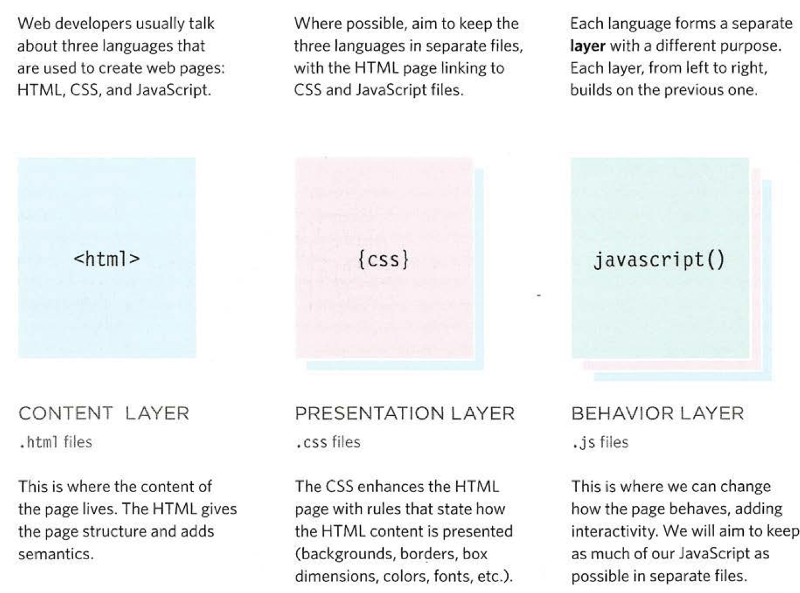
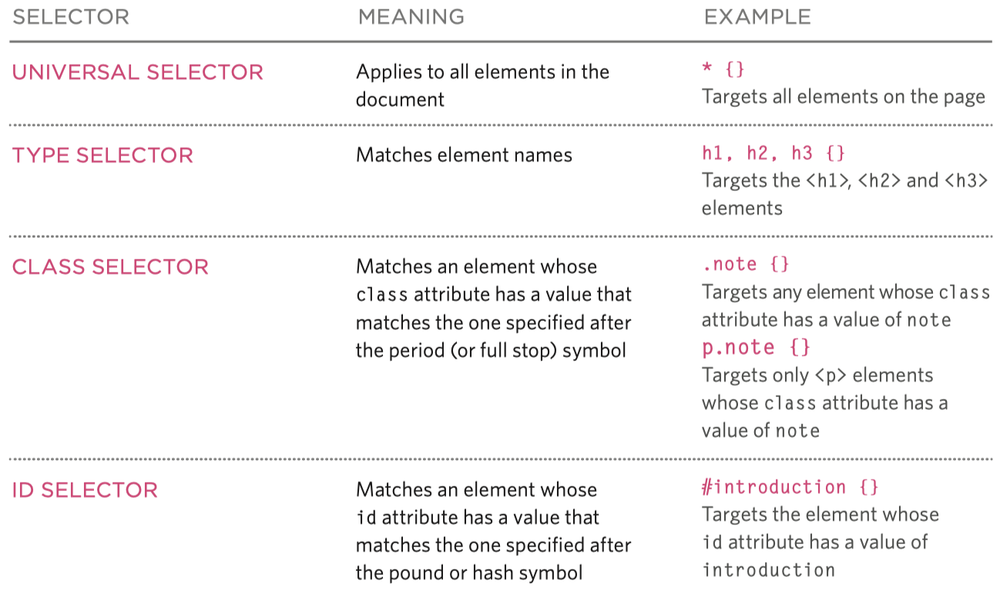

# CH01 概述与基本知识

## Web简介

### 一、Web和互联网的关系

**互联网是基础设施，Web是互联网的一项服务(应用)。**

互联网(Internet)：互联网是指20世纪末兴起的计算机网络模式，通过一系列网络协议实现计算机与计算机之间的网络通信，是一种网络基础设施(Infrastructure)，与之对应有局域网、城域网、广域网等。
World Wide Web：万维网，简称Web、WWW，是一种基于互联网进行访问的应用模式，其主要要素包括HTTP、HTML、URL、浏览器等。
万维网并不等同于互联网，万维网是基于互联网这一基础设施提供的服务之一，互联网上还要其他服务和应用类型，如电子邮件、网络游戏等。

### 二、Web的发展1.0，2.0，3.0

- Web1.0：主要由平台/公司搭建服务器、创造内容，以**静态或动态网页**的形式向互联网上的用户提供信息，用户一般不参与内容的创造，也很少互动，所以Web1.0也被称为**只读网络**。
- Web2.0：随着社交网络平台的诞生而出现，平台/公司除了向用户提供内容外，更多的是提供平台来共享用户生产的内容，并让用户间可以交互。网络不再是只读的，而是**可读可写的网络**。
- Web3.0：是近一两年来提出来的一个定义模糊的概念，大致思想包括去中心化、无需许可/审核、用户拥有内容、原生支付等。

## Web应用程序的工作原理

### 一、请求-响应模式

客户端把**请求**发送到服务器端的Web应用程序，Web应用程序接收请求后进行相关处理，并把客户端请求的资源以文本、图片、网页等形式(**HTML**),做为**响应**返回到客户端。

### 二、B/S与C/S

- C/S架构：客户机Client/服务器Server
- B/S架构：浏览器Browser/服务器Server

### 三、Web服务器

## Web的三个基础技术（coding）

### 一、HTTP

HTTP：HyperText Transfer Protocol 超文本传输协议

- 请求：请求行、请求头、请求体
    - GET：从服务器获取资源
    - POST：向服务器提交实体内容
- 响应：响应行、响应头、响应体
- 请求类型
    - 网页：text/html
    - 字符串：text/plain
    - 图片：image/jpeg
- 状态码
    - 网页：text/html
    - 字符串：text/plain
    - 图片：image/jpeg


### 二、URL&URI

- URL：Uniform Resource Locator 统一资源定位符
    - HTTP协议规定互联网用户通过输入URL地址或点击URL链接，实现对服务器上资源的请求。
- URI：Uniform Resource Identifier 统一资源标识符
    - 是标识逻辑或物理资源的字符序列，与URL类似，也是一串字符。通过使用位置，名称或两者来标识Internet上的资源；它允许统一识别资源。

有两种类型的URI，统一资源标识符（URL）和统一资源名称（URN）

# CH02 Servlet基础

## Java Web基础

### Web服务器和Web容器的概念

什么是Web容器？
- 由来：由于Web服务器的主要功能处理HTTP协议，响应针对静态内容(包括静态网页和图片等)的请求，所以在动态页面的应用中需要一个处理服务端逻辑的应用程序。
- 容器：容器是中间件的一种，给处于其中的应用程序提供一个统一的环境，降低应用程序的复杂性。
- 给Web应用的服务端程序提供运行环境的容器就称为**Web容器**。常见的Web容器有**Tomcat(Servlet容器)**、JBoss(EJB容器)和IIS(ASP容器)等。
- Web容器的主要功能包括通信支持、生命周期管理和多线程支持等。


### Tomcat

- 概念
    - Tomcat是Java Web应用开发中常用的开源Web容器
    - Tomcat的准确定位应为：**Java Web容器+Web服务器**。
    - 作为Web服务器，Tomcat能完成Apache的部分功能，如实现HTTP协议、处理请求/响应等，默认在**8080**端口监听。
    - 作为Java Web容器，**Tomcat负责编译、运行、部署Servlet/JSP，也叫Servlet容器。**
- 目录结构
     bin目录：可执行程序，包括启动和关闭的脚本startup.sh和shutdown.sh
     conf目录：配置文件，包括核心配置文件server.xml和context.xml
     lib目录：库文件，包括编写Servlets必须servlet-api.jar和jsp-api.jar
     webapps目录：Web应用程序。每个web应用程序都需要有一个目录，名称映射根路径
- 使用

### XML

- 概念
    - XML：eXtensible Markup Language，可拓展标记语言
- 语法和格式要求
    - 语法规定一个XML文档由两部分组成：**声明**和**文档元素**
    - 格式良好不一定有效
    - 有效的XML文档常用规范
        - DTD：文档类型定义
        - XSD：XML模式定义

## Servlet（coding）

### javax.servlet Servlet接口

javax.servlet： 定义Servlet和Servlet容器之间契约的类和接口
javax.servlet.http: 定义基于HTTP协议的Servlet的类和接口

生命周期方法
- init()
- service()
- destroy()
Servlet的生命周期包括**加载、实例化、处理客户端请求和销毁**。
当有请求到达时，Tomcat容器负责加载Servlet，然后调用init()方法进行初始化操作，紧接着开启一个service()方法线程进行处理请求，当所有的service()线程均执行完成后，Tomcat容器垃圾回收机制调用destroy()方式销毁Servlet。

``` Java
public interface Servlet {
    void init(Servlet Config var1) throws ServletException;

    ServletConfig getServletConfig();

    void service(ServletRequest var1,ServletResponse var2) throws ServletException,IOException;

    String getServletInfo();

    void destroy();
}
```

### javax.servlet.http

- HttpServlet
    - doPost()
    - doGet()
- HttpServletRequest
    - `String getParameter(String name)`：返回请求指定参数的值
    - `HttpSession getSession()`：返回与请求相关的Session对象
- HttpServletResponse
    - `void sendRedirect(String url)`：重定向到新的URL
- HttpSession

``` Java
public class FirstServlet extends HttpServlet{

    protected void doPost(HttpServletRequest request,HttpServletResponse response) throws ServletException,IOException{
        response.setContentType("text/html");
        PrintWriter writer=response.getWriter();
        writer.print("...");    //Some HTML in ...
    }

    protected void doGet(HttpServletRequest request,HttpServletResponse response) throws ServletException,IOException{
        doGet(request,response);
    }
}
```

# CH03 Web开发应用基础和JSP

## Web应用开发核心概念

### 组件关联关系

- 请求转发：**forward，是指将客户端的请求转发给同一个应用程序中的其他Web组件**
    - 请求转发表明该次请求并没有完成，只是转交给其他组件去完成，客户端并不清楚转发的过程，客户端地址栏不发生改变。
    - 在Servlet API中通过RequestDispatcher接口的forward()来实现HTTP请求的转发，同时将请求和响应对象传递给目标组件。
    - 具体的操作方式有：request.getRequestDispatcher(“目标”).forward()等。
- 请求重定向：**redirect，是指将客户端的请求重定向到其他任意的URL上**
    - 请求重定向后即表明该次请求响应流程已完成，返回一个响应给客户端(地址栏发生改变)，客户端根据响应发起一次新的请求，不能使用之前的request对象。
    - 在Servlet API中通过ServletResponse的sendRedirect()来实现重定向。
    - 具体的操作方式有：response.sendRedirect(“目标”)。

### 会话跟踪

什么是会话跟踪？
- HTTP协议本质上是一个无状态协议，基于请求-响应的通信模式，所以服务端和客户端之间无法保持连接，保持会话状态。
- 会话跟踪就是一系列维持Web应用中客户端和服务端会话状态的编程技术。

Web应用开发中常用的会话跟踪方法有：
- URL重写
    - URL重写实现会话跟踪
        - URL重写的实现方式是将一个或多个token作为参数，添加到URL字符串中，每个token以key=value的方式表现。
        - URL重写适用于无需在太多页面之间保持会话的场景。
    - URL重写的会话跟踪有如下限制：
        - URL字符串的总长度取决于浏览器限制
        - URL重写需在服务端完成，token过于复杂难以操作
        - 某些字符(空格，问号等)必须用base64编码
        - 所有信息在地址栏均可见，安全性低
- 隐藏域
    - 使用隐藏域的实现方式和重写URL方法类似，区别是将附加在URL中的token信息放置到form表单的隐藏域中。
    - 相对于URL重写方式：
        - 没有字符数限制
        - 无须进行特殊编码
- 客户端保存信息：Cookies
    - Cookie是一个对象，其内容主要包含以key-value形式保存的token信息
    - Cookie作为HTTP请求头的一部分，其传输由HTTP协议控制。
    - Cookie可以由服务端构建，也可以由浏览器端的JavaScript语言构建，最终都保存在浏览器中。
    - Cookie对象除了包含token信息外，还有maxAge、path等属性。
    - 用Cookies方式来进行会话跟踪的主要缺点是用户可在浏览器进行限制。
- **服务端保存信息：HttpSession**
    - HttpSession是所有的会话跟踪技术中最安全和最常用的技术。
    - 其**基本原理**是：用户第一次请求服务器时，由服务器创建HttpSession对象，并生成唯一的用户ID(JSESSIONID)，其他会话token信息以key-value的方式保存在HttpSession对象中，将用户ID以Cookie或URL的方式告知客户端浏览器，整个过程由Web容器进行管理和控制。
    - 服务端程序通过HttpServletRequest对象的getSession()方法获取HttpSession对象，HttpSession提供一系列方法实现上述功能。

### 数据的作用域

Web应用中，多个Web组件通过彼此关联来实现协作，共同完成客户端的请求，这个过程中就会涉及到数据的作用域问题。

按作用域的由小到大，作用域分为：
- **页面范围(page)**：一个Servlet类或一个JSP页面；
- **请求范围(request)**：一个请求过程的范围，请求被响应之间；
- **会话范围(session)**：会话范围，整个会话持续过程；
- **应用范围(application)**：服务器运行过程中(ServletContext)。

Web应用是**通过将值或对象放入对应的作用域对象中**，来实现数据作用域控制的，作用域对象均提供setAttribute()和getAttribute()方法。

## JSP

### JSP和Servlet的关系

JSP的由来：用Servlet编写Web应用，导致服务端代码过于繁琐和复杂，将Servlet中的静态部分和动态部分分开编写，同时提供类似HTML的写法，这就是Java动态网页技术，**Java Server Page**。

``` JSP
<html>
<head>
    <title>Hello示例</title>
</head>
<body>
<%
    out.println("Hello:"+name);
%>
</body>
</html>
```

- JSP是一种建立在**Servlet规范**提供的功能之上的动态网页技术。
- **JSP文件**在用户第一次请求时，会**被转译成Servlet**，然后由这个Servlet处理用户的请求，JSP可以看成是运行时的Servlet。
- 本质上说，JSP就是一种为了方便程序员编写的Servlet表现形式。

### JSP语法（coding）

- 指令:`<%@ DirectiveAttribute="value" %>`
- 表达式:`<%=表达式 %>`
- 标准动作:`<jsp:动作名 >`
- 注释:`<%-- --%>`
- 隐式对象
    - 隐式对象是指在JSP脚本元素中，不需要任何的声明和定义就可以直接使用的对象


## JDBC（coding）

JDBC是Java数据库连接(Java Database Connectivity)的简称。
JDBC API采用接口和实现分离的设计思想，其中接口主要包含在**java.sql**包中，之后的扩展内容在javax.sql包中。

### JDBC实现数据库的CRUD(创建读取更新删除)

常用JDBC API使用详解
- 加载驱动:`class.forName("com.mysql.jdbc.Driver")`
- 获得连接:`Connection connection = DriverManager.getConnection("jdbc:mysql://127.0.0.1:3306/demo","root","123")`
- 执行SQL
    - `Statement statement = connection.creatStatement();`
    - `Result resultSet = statement.excuteQuery(sql);`
    - `int result = statement.excuteUpdate(sql);`
- 访问结果
    - `String username = resultSet.getString("username");`
    - `String password = resultSet.getString(2);`

``` java
public class JDBCDemo {
    public static void main(String[] args) {
        try {
            Class.forName("com.mysql.jdbc.Driver"); //IMPORTANT!

            Connection connection = DriverManager.getConnection("jdbc:mysql://127.0.0.1:3306/demo","root","");  //IMPORTANT!

            Statement statement = connection.createStatement();

            String sql = "INSERT INTO userinfo VALUES (1,'Bill Gates','bill@microsoft.com',SS)";    //IMPORTANT!

            int result = statement.executeUpdate(sql);

            if(result == 1){    //IMPORTANT!
                System.out.println("Insert new user success");
            }

            statement.close();
            connection.close();
        } catch (Exception e){
            e.printStackTrace();
        }
    }
}

public class JDBCDemo2 {
    public static void main(String[] args){
        try {
            Class.forName("com.mysql.jdbc.Driver");

            Connection connection = DriverManager.getConnection("jdbc:mysql://127.0.0.1:3306/demo","root","");

            Statement statement = connection.createStatement();

            String sql = "SELECT * FROM userinfo";

            ResultSet resultSet = statement.executeQuery(sql);

            while(resultSet.next()){
                System.out.print(resultSet.getInt(1)+"\t");
                ...
            }

            resultSet.close();
            statement.close();
            connection.close();
        } catch (Exception) {
            e.printStackTrace();
        }
    }
}
```

### JDBC代码的优化

``` java
public class DBUtil {
    private static String Driver = "com.mysql.jdbc.Driver";
    private static String url = "jdbc:mysql://127.0.0.1:3306/demo";
    private static String username = "root";
    private static String password = "";

    public static Connection.getConnection() throws Exception {
        try {
            Class.forName(driver);
            return DriverManager.getConnection(url,username,password);
        } catch (Exception e) {
            throw e;
        }
    }

    public static void closeConnection(Connection connection) throws Exception {
        if (connection != null) {
            connection.close();
        }
    }

private static void closeStatement(Statement statement) throws Exception ... ;
private static void closePreparedStatement(PreparedStatement pStatement) throws Exception ... ;
private static void closeResultSet(ResultSet resultSet) throws Exception ...;
}

public class User {
    private int id;
    private String name;
    private String email;
    private int age;

    public User(){

    }

    ... //get and set
}

public class UserDao {
    private static String insertUserSQL = "INSERT INTO userinfo VALUES (?,?,?,?)";

    private static String updateUserSQL = "UPDATE userinfo SET username=?,email=?,age=? WHERE id=?";

    private static String deleteUserSQL = "DELETE FROM userinfo WHERE id=?";

    private static String selectUserSQL = "SELECT * FROM userinfo WHERE id=?";

    private static String selectAllUserSQL = "SELECT * FROM userinfo";

    public boolean insertUser(User user) throws Exception {...}

    public boolean updateUser(User user) throws Exception {...}

    public boolean deleteUser(User user) throws Exception {...}

    public User selectUser(int id) throws Exception {...}

    public ArrayList<User> selectAllUser() throws Exception {...}
}
```

# CH04 开发模式和MVC

## 开发模式的概念

### Why?

### Model Ⅰ: JSP+JavaBean

Model I是指基于JSP+JavaBean的开发模式，JSP负责Web相关的部分，包括数据的展示，请求逻辑的控制等；JavaBean负责业务逻辑的部分，包括数据的存取，业务的实现。


一般意义上的JavaBean是指一种用于封装数据和业务逻辑的实体类，为可复用组件

Model I只适用于中小型Web应用的开发，由于：
- 虽然使用JavaBean从Web应用中解耦了业务逻辑，但是用户的请求访问**逻辑、数据内容与表示**仍然没有分离。
- JSP的固有特征使其更适合作为数据展示和表达的技术规范。

### Model Ⅱ: JSP+Servlet+JavaBean

Java Web中的MVC具体表现为：模型由JavaBeans组成，视图由JSP页面组成，控制器由Servlets实现。


在Java Web应用的开发中，一般将Model还进一步细分为：完成业务逻辑的**业务Bean**、实现数据持久化操作的**DAO**和仅用于表达数据的**值对象POJO**。

## MVC（Coding）

### 基本原理

MVC模式认为程序不论简单或复杂，从结构上看都可以分为三层：
- 视图层View：用户界面
- 数据层Model：程序中的数据或信息
- 控制层Controller：负责视图层和数据层的交互


MVC模式的最佳实践
- MVC模式中的三层是紧密联系在一起的，但更重要的是**相互独立性**，每一层内部的变化不影响其他层。
- 层与层之间通过接口(Interface)进行交互，应尽量做到**面向接口编程**。

### JavaWeb中MVC的实现

### 项目结构和代码组织

##  JSTL和EL（Coding）

- JSTL
    - 基本概念：标准标签库：JSTL，JSP Standard Tag Library
    - 语法和用法
        - 基本语法：`<%@ taglib url="http://java.sun.com/jsp/jstl/core" prefix="c" %>`（国际化 core改fmt c改fmt）
        - 用法
            - `<c:if>`：条件判断
            - `<c:choose>`(when otherwise)：条件嵌套，switch
            - `<c:foreach>`：循环
            `<fmt:formatDate>`：格式化显示
- EL
    - 基本概念：EL(Expression Language)表达式语言是JSP的重要特性之一
    - 语法和用法
    -   - 基本语法：`${Expression}`
        - []和.运算符：用于对象属性或数组、集合

# CH05 Servlet和JSP进阶

## 过滤器

Servlet API还提供一系列的用于**拦截**Request请求和Response响应的API接口，在Java Web应用的开发中通过调用这些API在**用户访问资源前或服务器完成响应后**进行某些特定的处理。


### 使用场景

- 对用户请求进行统一认证
- 对用户访问进行审核和统计
- 对用户发送的数据进行过滤或替换
- 转换字符编码、图像格式等
- 对响应内容进行压缩，减少网络传输量
- 对请求或响应数据进行加/解密处理

### 语法和用法（coding）

实现过滤器的方法总体上和Servlet类似
1. 实现相关监听器接口，并完成具体的监听方法；
2. 在容器内通过配置文件或注解配置监听器；

``` java
public class xxxFilter implements Filter {
    init();
    doFilter();
    destroy();
}
```

由于一个应用中可能存在多个过滤器，而多个过滤器的先后顺序必须通过web.xml中的配置顺序进行确定。

过滤器的功能主要是通过doFilter()方法来实现的，方法原型为：
``` java
void doFilter(ServletRequest request,ServletResponse response,FilterChain filterChain)
```
请求对象request、响应对象response、过滤器链对象filterChain

``` java
public class CodeFilter implements Filter {
    public void destroy() {}
    public void init(FilterConfig arg0) throws ServletException {}
    public void doFilter(ServletRequest request,ServletResponse response,FilterChain chain) throws IOException,ServletException {
        HttpServletRequest req = (HttpServletRequest) request;
        req.setCharacterEncoding("UTF-8");  //IMPORTANT!
        chain.doFilter(request,response);
    }
}
```
``` XML
<filter>
    <filter-name>CodeFilter</filter-name>
    <filter-class>servlet.CodeFilter</filter-class>
</filter>

<filter-mapping>
    <filter-name>CodeFilter</filter-name>
    <url-pattern>/*</url-pattern>   //IMPORTANT!
    <dispatcher>REQUEST</dispatcher>
</filter-mapping>
```

## 监听器

Servlet API提供一系列的事件和事件监听接口，在Java Web应用的开发中通过调用这些API可以进行**事件驱动**的开发


### 使用场景

### 语法和用法（coding）

编写监听器的方法和编写Servlet类似：
1. 实现相关监听器接口，并完成具体的监听方法
2. 在容器内通过配置文件或使用注解配置监听器

``` java
@WebListener
public class xxxListener implements xxxListener {
    //对应事件开发
}
```
``` XML
<listener>
    <listener-class> fully-qualified class </listener-class>
</listener>
```

监听器使用范例：记录一个请求在服务器消耗的时间
``` java
public class PerfStatListener implements ServletRequestListener {

    public void requestInitialized(ServletRequestEvent sre) {
        ServletRequest servletRequest = sre.getServletRequest();
        ServletRequest.setAttribute("start",System.nanoTime()); //IMPORTANT!
    }

    public void requestDestroyed(ServletRequestEvent sre) {
        ServletRequest servletRequest = sre.getServletRequest();
        Long start = (Long) servletRequest.getAttribute("start");
        Long end = System.nanoTime();
        HttpServletRequest httpServletRequest = (HttpServletRequest) servletRequest;
        String uri = httpServletRequest.getRequestURI();
        System.out.println("time taken to execute" + uri + ":" + ((end-start)/1000) + "ms");
    }
}
```

## JavaWeb技术栈总结（coding）

# HTML&CSS

## HTML、CSS和javascript三者的关系



## HTML

### HTML的结构


### 块和行的概念


## CSS

### CSS的概念


### 基本语法（coding）

#### 选择器

- 标签选择器
- 类选择器
- ID选择器




*SPECIFICITY:If one selector is more specific than the others, the more specific rule will take precedence over more general ones.*

#### 属性

- 字体 font
    - PIXELS
    - PERCENTAGE
- 颜色 color
    - RGB VALUES
    - HEX CODES
    - COLOR NAME
- 边框 border,margin&padding


### 布局方式（coding）

#### 普通流

position:static
每个块级元素都换行显示，垂直向下排列


#### 相对定位

position:relative
在普通流的位置给出上下左右相对位移

``` CSS
p.example{
    position:relative;
    top:10px;
    left:100px;
}
```


#### 绝对定位

position:absolute
脱离普通流，直接用位置参数定位显示

``` CSS
h1{
    position:absolute;
    top:0px;
    left:500px;
    width:250px;
}
```


#### 固定定位

position:fixed
绝对定位的一种形式，将元素相对于浏览器定位

``` CSS
h1{
    position:fixed;
    ... //top padding ...
}
```


#### 浮动元素

浮动一个元素让其脱离普通流，根据参数浮动

``` CSS
blockquote{
    float:right;
    width:275px;
    ...
}
```


#### z-index

*任何元素从普通流脱离时，盒子将会产生重叠，用z-index属性控制层级*

# JavaScript

## 概念

### 用途

JavaScript是目前广泛用于**客户端**开发的一种**脚本语言**，在“大前端”的背景下，也可用于服务端开发。

### 特点

- JavaScript语言最初由Netscape公司的Brendan Eich设计，是一种**动态、弱类型、基于原型的语言，内置支持类**
- 对于JavaScript，你常常需要学习各种解决问题的模式

### 使用方式（coding）

网页内部使用：
``` js
<script>
    //js代码
</script>
```

网页外部：
``` js
<script src = "***.js">
</script>
```

## 语法

### 基本语法（coding）

#### 变量与数据类型

- 弱类型变量和更简洁灵活的基本类型
    - JavaScript是弱类型的语言，基本类型变量通过var声明`var 变量名;`。
- 变量名命名规范和Java的区别是多一个$字符。
- 动态赋值与变量提升
    - JavaScript 是一种动态类型语言，也就是说，变量的类型没有限制，变量可以随时更改类型。
    - JavaScript 引擎的工作方式是：先解析代码，获取所有被声明的变量，然后再一行一行地运行。导致所有的变量的声明语句，都会被提升到代码的头部，这就叫做变量提升（hoisting）。

- JavaScript共有六种数据类型(ES5)：
    - 数值（number）：整数和小数（比如1和3.14）
    - 字符串（string）：文本（比如Hello World）
    - 布尔值（boolean）：表示真伪的两个特殊值，即true（真）和false（假）
    - undefined：表示“未定义”或不存在，即由于目前没有定义，所以此处暂时没有任何值
    - null：表示空值，即此处的值为空
    - 对象（object）：各种值组成的集合
- 说明：
    - 数值、字符串、布尔值，被称为原始类型或基本类型，对象被称为合成类型
    - 对象又可以分为狭义的对象(object)、数组(array)、函数(function)
    - 除非特别声明，一般讲的对象就是指狭义的对象object

关于null和undefined
- 在变量使用层面，可认为二者在使用和结果上没有区别，都表示“没有”。
- 更细节的区分是：null表示空值，即该处的值现在为空。如调用某个函数时，需要一个参数，可是不知道传入什么，这时就可以传入null，表示“我知道需要一个参数，但没值可传”。
- 反之，如果知道需要一个参数，却什么也不传，这时候调用函数的结果就是undefined，即“未定义”。

关于NaN
- NaN是 JavaScript 的特殊值，表示“非数字”（Not a Number），主要出现在数值运算发生错误或将字符串解析成数字出错的场合。
- NaN不是独立的数据类型，而是一个特殊数值，其数据类型依然属于数值。
- NaN不等于任何值，包括自身，与任何数值进行运算的结果都是NaN。
- NaN在布尔运算时被当作false。

#### 数组

- JavaScript语言中的数组表面上和Java中的数据类似，有两种创建的方式（字面和new关键字），推荐使用字面方式创建数组。
- 同时数组也是对象，也支持对象的相关操作，比如length()和item(index)等方法。
- 但本质上，要理解JavaScript数组，需要结合堆数组、栈数组和数组空间动态分配(malloc)的概念。

#### 函数

- 声明函数通过function关键字
- 函数没有返回值类型的声明
- 如果有形参，形参没有类型的声明

##### 标准函数

``` js
function area() {
    return width*height;
};

var size = area(3, 4);
```

##### 匿名函数

``` js
var area = function(width,height) {
    return width * height;
};

var size = area(3, 4);
```

##### 立即执行匿名函数

``` js
var area = (function(){
    var w = 3;
    var h = 2;
    return w * h;
}());
```

#### 对象

- 对象（object）是 JavaScript 语言的核心概念，也是最重要的数据类型。
- 对象是一组“键值对”（key-value）的集合，是一种无序的复合数据集合。
- 键名：对象的所有键名都是字符串，加不加引号都可以。
- 读取对象的属性有两种方法：一种是使用点运算符，还有一种是使用方括号[]运算符。
- 对象也符合JavaScript的动态语言特性，属性可以被删除，判断对象是否有某个属性，可以使用in运算符。

对象基本语法
``` js
var hotel = {
    name:'Quay';
    rooms:40;
    booked:25;
    gym:true;
    roomTypes:['twin',"double","suite"];
    checkAvailability:function(){
        return this.rooms - this.booked;
    }
}
```

### 内置对象


#### BOM

#### DOM

#### 全局对象

# CH08 AJAX

## BOM和DOM模型

### BOM中常用对象

BOM：Browser Object Model，浏览器对象模型

window当前浏览器窗口
- document网页文档
- history浏览历史记录
- location地址栏URL
- navigator浏览器信息
- screen设备屏幕信息

### DOM树的概念

DOM：Document Object Model，文档对象模型。

文档对象模型DOM规定了浏览器应该如何创建HTML元素，以及JavaScript如何操作HTML元素。

- 当浏览器加载Web页面时，在内存中创建页面模型——DOM树对象模型
- JavaScript操作HTML页面内容时，是通过一系列API实现的——DOM API

DOM树中每个节点都是对象，拥有方法和属性，可以分为**文档节点、元素节点、属性节点和文本节点**四大类型。

### 使用JS访问DOM（coding)

#### 访问和更新元素

DOM常用API——访问元素
- 返回单一元素节点
    - getElementById('id')
    - querySelector('css selector')
- 返回一个或多个元素节点（NodeList）
    - getElementByClassName('class')
    - getElementByTagName('tag’)
    - querySelectorAll('css selector')

DOM常用API——遍历元素
- 定位到某个元素后，可以使用如下API遍历整个DOM树：
    - parentNode
    - previousSibling
    - nextSibling
    - firstChild
    - lastChild

#### 访问和更新元素内容

- DOM常用API——获取或更新元素内容
    - 文本节点：nodeValue属性
    - 元素节点
        - textContent属性
        - innerText属性
        - createElement()、createTextNode()、appendChild()和removeChild()方法
        - innerHTML属性

### 事件处理（coding）

DOM模型针对浏览器和网页内容规定了一系列的用户动作行为，称为网页事件。

网页事件从类型上可以分为：
- 浏览器事件
- 键盘事件
- 鼠标事件
- 焦点事件
- 表单事件
- DOM事件

#### 事件处理的基本概念

JavaScript事件处理分为三个步骤：选定元素、事件绑定、事件处理。

#### 事件绑定的三种方式

事件绑定有三种方法：**HTML绑定、传统DOM绑定和DOM监听器**。

HTML方法
``` HTML
<input type="text" id="username" onblur="checkUsername()" />
```

传统DOM方法
``` JS
var elUsername = document.getElementById('username');
elUsername.onblur = checkUsername;
```
DOM监听器方法
``` JS
var elUsername = document.getElementById('username');
elUsername.addEventListener('blur',checkUsername,false);

var elUsername = document.getElementById('username');
elUsername.addEventListener('blur',function(){
    checkUsername(5);
},false);
```

## AJAX

### 基本概念

#### Why?

- 更丰富的用户体验和全新的交互方式
- 局部刷新页面，而不是整个页面
- 连续不间断的网站使用体验
- 提供类似C/S应用的交互效果

#### What?

AJAX：Asynchronous JavaScript And XML
- Asynchronous：异步，客户端和服务端的通信方式
- JavaScript：一种客户端脚本语言(HTML、CSS、DOM)
- XML：数据的表示方式(JSON)

#### 同步和异步的通信机制

同步通信方式：即典型的请求响应模型。在传统的Web应用模型下，大部分的用户操作都会发送一个HTTP请求给服务器，然后服务器开始处理(接收数据，执行业务逻辑，访问数据库等)，最后向浏览器返回HTML页面

异步通信方式：异步发送请求，消除了传统的“发送请求－等待－发送请求－等待”的特性，极大的提高了用户体验，实现这种通信方式的核心技术是浏览器的**XMLHttpRequest**对象

### XMLHttpRequest对象（coding）

常用方法
- `open("method","url")`：建立对服务器的调用，method参数表示请求方法，url表示请求的资源
- `send(content)`：向服务器发送请求

常用事件和属性
- onreadystatechange：请求的状态发生改变
- readyState：表示请求状态的属性。0-未初始化，1-正在加载，2-已加载，3-交互中，4-完成
- responseText：服务器的响应，表示为一个字符串
- responseXML：服务器的响应，用XML封装，可被解析为DOM
- status：服务器状态码

### AJAX应用的流程（coding）

客户端


服务端


# CH09 jQuery

## Ajax使用进阶

### Ajax应用中的三种数据表示方式（coding）

在Ajax应用中服务器和客户端之间传输数据有三种表示方式：**简单字符串、XML、JSON**。
- 简单字符串方式一般用于传递“Yes/No”此类数据本身无结构的数据。
- XML方式常用于复杂数据的表示，一般来说，数据本身有结构化要求，数据量也比较大。
- JSON方式常用于中小型数据的表示，也是目前应用最广泛的数据表示方式。
``` XML
<?xml version="1.0" />
<list>
    <product>
        <name>Koi</name>
        <description>images/fish3.gif</description>
    </product>
    ...
</list>
```
``` JSON
{
    {
        "description":"images/fish3.gif",
        "name":"Koi"
    }
}
```

- JSON字符串：其本质是一个有格式要求的**普通字符串**
- JSON对象：JS中的一个**内置对象**

### 跨域访问

跨域问题的来源
- 跨域问题的根源是浏览器的**同源策略**。
- 同源策略：浏览器的安全策略之一，指一个网页的内容只能来自于同一个服务器来源。
- 同源：规范认为两个URL如果**协议、主机名、端口**均一致则同源，三者当中有一个不相同则认为不同源。

### Ajax经典应用场景

- 表单验证
- 动态加载列表框
- 创建自动刷新页面
- 显示进度条
- 创建工具提示
- 自动补全功能
- 访问Web服务

## 概念

### Why?

使用AJAX技术的Web应用需要在HTML页面中编写**大量的JavaScript代码**。并且此类代码的复杂性主要体现在**对DOM的操作**。

- jQuery is a fast, small, and feature-rich **JavaScript library**.
- It makes things like *HTML document traversal and manipulation, event handling, animation, and Ajax* much simpler with an easy-to-use API that works across a multitude of browsers.

### 使用方式（coding）

在开发中使用jQuery框架很简单，只需将相应版本的对应的.js文件(jquery-3.4.1.js)引入到项目中即可(线上部署项目还可以使用CDN方式引用jQuery)。

## 语法（coding）

### 基础语法 $(selector).action()

- $：用于在JS中标识jQuery
- selector：选择器，用于查找或查询HTML元素
- action()：指对选择的元素执行的特定操作

### 文档就绪函数

为了防止HTML文档在完全加载之前运行jQuery代码，一般会将所有的jQuery调用放到文档就绪函数中。

``` JS
$(document).ready(function() {
    // Your script goes here
});
```

### 常用动作

- 获取元素内容
    - `.html()`：获取元素的所有内容，包括元素
    - `.text()`：获取元素中所包含的文本内容
- 修改元素内容
    - `.html('content')`
    - `.text('content')`
    - `.replace('content')`
    - `.remove('content')`
- 插入元素（见下图）
    - `.before()`
    - `.after()`
    - `.prepend()`
    - `.append()`
- 迭代元素（见下代码）


``` js
$(function() {
    $('li').each(function() {
        var ids = this.id;
        $(this).append('<span class="order">' + ids + '</span>');
    });
});
```
### 事件处理

`.on()`
``` js
// 事件处理
$('li').on('click',function() {
    $(this).addClass('complete');
});

// 带对象的事件处理
$('li').on('click',function(e) {
    eventType = e.type;
});

// on的完整用法
.on(events[,selector][,data],function(e));
```

# JavaScript进阶

## jQuery与AJAX

### 使用jQuery简化AJAX操作常用API（coding）

jQuery提供一系列API简化AJAX操作，下表为**请求相关API：
- **`$.ajax()`**：最核心的方法，其他方法均为`$.ajax()`的简化

`$.ajax()`的详细使用：
- type：HTTP请求方法，包括GET、POST等
- url：请求的服务端URL
- data：发送给服务器或者从服务器获取的数据
- success：请求成功时的回调函数
- error：请求错误时的回调函数

使用')

## 深拷贝与浅拷贝（coding）

浅拷贝
``` js
var name = "鸣人"

var person = {
    name: "宁次",
    age: 20,
}

var name2 = name
var person2 = person
```


深拷贝
``` js
var person = {
    name: "宁次",
    age: 20,
}

var person2 = {}
person2.name = person.name
person2.age = person.age
```


深拷贝的问题
``` js
var person = {
    name: "宁次",
    age: 20,
    sister: {
        name: "雏田",
        age: 18,
    },
}

var person2 = {}
person2.name = person.name
person2.age = person.age
person2.sister = person.sister;

person2.name = "鸣人"

alert(person.name)  //宁次

person2.sister.name="鸣妹"
alert(person.sister.name)   //鸣妹，第二层为浅拷贝
```

数组使用经典范例
``` js
var arr = [1,2,3,4,5];

arr.forEach( function(value, key, arr1) {
    value++;
});

console.log(arr);   //1,2,3,4,5
```
``` js
var arr = [1,2,3,4,5];

arr.forEach( function(value, key, arr1) {
    value++;
    arr1[key] = value + 10;
});

console.log(arr);   //11,12,13,14,15
```

## this关键字（coding）

- this是JavaScript中的一个非常重要的语法点和精华所在。
- 简单来说，*this是一个指向对象的引用(指针)，指向属性或方法“当前”所在的对象。*

``` js
var a = {
    p: 'Hello',
    b: {
        m: function () {
            console.log(this.p);
        }
    }
};

a.b.m() // undefined
```

**函数嵌套中避免多层this**：使用一个变量固定this的值，然后内层函数调用这个变量。

``` js
var o = {
    f1: function () {
        var _this = this;
        console.log(this);
        var f2 = function () {
            console.log(_this);
        }();
    }
}

o.f1(); // Object    //Object
//if miss   // Object   //Window
```